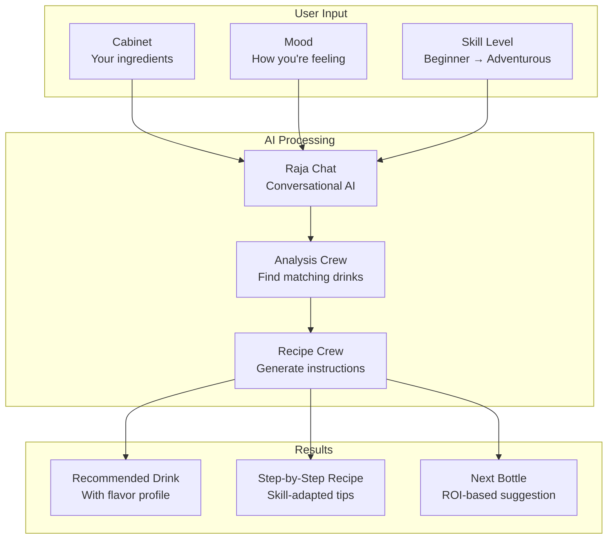
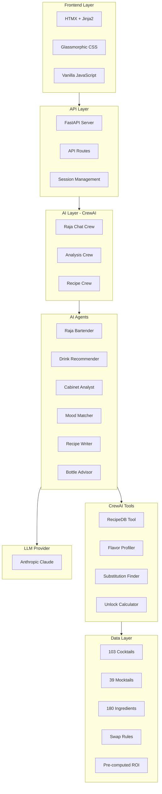
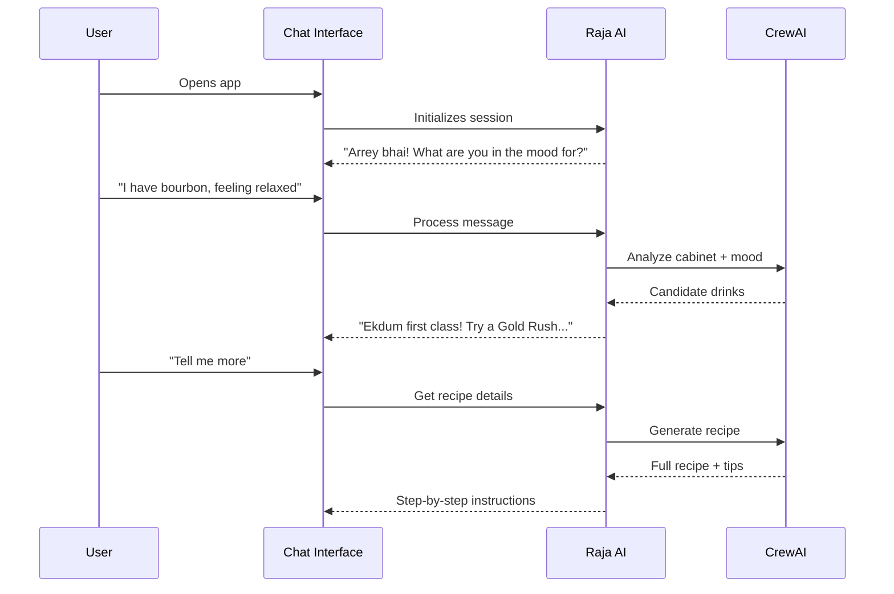
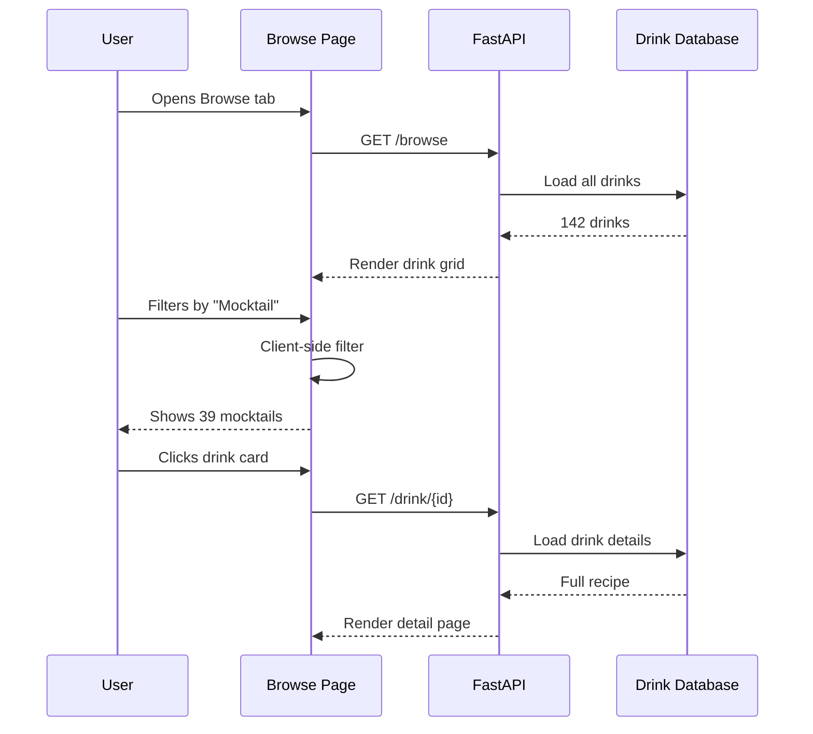
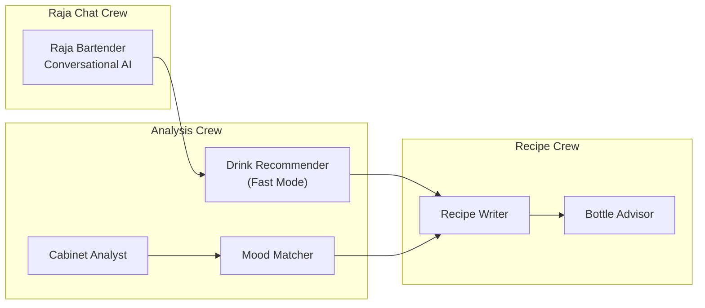

# Cocktail Cache

> **Your cabinet. Your mood. Your perfect drink.**

<p align="center">
  <a href="https://cocktail-cache.onrender.com"><strong>Try it Live</strong></a> &bull;
  <a href="https://github.com/darth-dodo/cocktail-cache">GitHub</a> &bull;
  <a href="docs/architecture.md">Architecture</a> &bull;
  <a href="docs/product.md">Product Docs</a>
</p>

<p align="center">
  <a href="https://cocktail-cache.onrender.com">
    
  </a>
</p>

<p align="center">
  <a href="https://github.com/darth-dodo/cocktail-cache">
    
  </a>
  
  
  
  
</p>

---

**Cocktail Cache** is an AI-powered home bar advisor that helps you craft perfect cocktails with whatever bottles you have. Chat with **Raja**, your AI mixologist from Bombay, to get personalized drink recommendations, technique guidance, and smart suggestions for your next bottle purchase.

---

## Why Cocktail Cache?

**The Party Host's Dilemma**: You have guests arriving, a random assortment of bottles accumulated over time, and you want to serve something better than rum-and-coke — but you don't know what's possible with your ingredients.

| Problem | Solution |
|---------|----------|
| "I don't know what I can make" | Shows all possibilities from your cabinet |
| "Recipes assume ingredients I don't have" | Only recommends what's actually makeable |
| "I don't know what to buy next" | "Next bottle" with ROI justification |
| "I'll mess up the technique" | Step-by-step with tips for your skill level |

---

## Features

### Chat with Raja - Your AI Mixologist

Meet **Raja**, a 20-year bartender veteran from Colaba, Bombay. He'll guide you to your perfect drink with personality and expertise:

- **Natural conversation** — Describe your mood, and Raja finds the right drink
- **Hindi phrases** — "Arrey bhai!", "Ekdum first class!", "Kya baat hai!"
- **Cocktail stories** — Learn about Leopold Cafe and Bombay's bar scene
- **Personalized recommendations** — Based on your cabinet, mood, and skill level

### Browse & Discover

- **142 drinks catalog** — 103 cocktails + 39 mocktails with detailed recipes
- **Smart search** — Find drinks by name or filter by type and difficulty
- **Individual drink pages** — Full recipes with ingredients, instructions, and flavor profiles
- **Shareable URLs** — Send `/drink/{drink-id}` links to friends

### Build Your Cabinet

- **Ingredient autocomplete** — Smart suggestions as you type
- **Categorized selection** — Spirits, modifiers, bitters, fresh, mixers
- **Persistent storage** — Your cabinet is saved locally

### AI-Powered Recommendations

- **Fast mode** — Single-agent analysis for ~50% faster responses
- **Skill adaptation** — Beginner-friendly to adventurous techniques
- **Next bottle advisor** — Maximize your drink potential with smart ROI

---

## How It Works



---

## System Architecture



---

## Quick Start

```bash
# Clone the repository
git clone https://github.com/darth-dodo/cocktail-cache.git
cd cocktail-cache

# Copy environment file and add your API key
cp .env.example .env
# Edit .env and add your ANTHROPIC_API_KEY

# Install dependencies and start development server
make install
make dev

# Visit http://localhost:8888
```

---

## User Flows

### Flow 1: Chat with Raja



### Flow 2: Browse & Discover



---

## Tech Stack

| Component | Technology | Purpose |
|-----------|------------|---------|
| **Runtime** | Python 3.12 | Core language |
| **API** | FastAPI | Web framework with async support |
| **AI** | CrewAI | Multi-agent orchestration |
| **LLM** | Anthropic Claude | Language model provider |
| **Frontend** | HTMX + Jinja2 | Dynamic HTML without JS frameworks |
| **Styling** | Tailwind + DaisyUI | Glassmorphic design system |
| **Package Manager** | uv | Fast Python package management |
| **Deployment** | Render | Cloud hosting with CI/CD |

---

## Development Commands

| Command | Description |
|---------|-------------|
| `make install` | Install dependencies with uv |
| `make dev` | Start development server (port 8888) |
| `make test` | Run test suite with coverage |
| `make check` | Run linting and type checks |
| `make format` | Format code with ruff |
| `make clean` | Remove build artifacts |

---

## Project Structure

```
cocktail-cache/
├── src/app/
│   ├── main.py              # FastAPI entry point
│   ├── config.py            # Environment configuration
│   ├── agents/              # CrewAI agent definitions
│   │   ├── raja_bartender.py    # Conversational AI agent
│   │   ├── drink_recommender.py # Fast mode unified agent
│   │   ├── cabinet_analyst.py   # Cabinet analysis
│   │   ├── mood_matcher.py      # Mood-based ranking
│   │   ├── recipe_writer.py     # Recipe generation
│   │   └── bottle_advisor.py    # Next bottle suggestions
│   ├── crews/               # Crew compositions
│   │   ├── raja_chat_crew.py    # Chat conversation crew
│   │   ├── analysis_crew.py     # Drink analysis crew
│   │   └── recipe_crew.py       # Recipe generation crew
│   ├── tools/               # CrewAI tools
│   │   ├── recipe_db_tool.py    # Drink database queries
│   │   ├── flavor_profiler.py   # Flavor analysis
│   │   ├── substitution_finder.py # Ingredient swaps
│   │   └── unlock_calculator.py   # ROI calculations
│   ├── models/              # Pydantic models
│   ├── services/            # Business logic
│   ├── routers/             # API routes
│   ├── templates/           # Jinja2 templates
│   └── static/              # CSS and JS assets
├── data/
│   ├── cocktails.json       # 103 cocktail recipes
│   ├── mocktails.json       # 39 non-alcoholic recipes
│   ├── ingredients.json     # 180 categorized ingredients
│   ├── substitutions.json   # Ingredient swap rules
│   └── unlock_scores.json   # Pre-computed bottle ROI
├── docs/                    # Documentation
├── tests/                   # Test suite
└── scripts/                 # Utility scripts
```

---

## AI Agent Architecture

### Crews Overview



### Agent Details

| Agent | Purpose | Tools Used |
|-------|---------|------------|
| **Raja Bartender** | Conversational AI with Bombay personality | All tools |
| **Drink Recommender** | Fast mode: find + rank in one call | RecipeDB, FlavorProfiler |
| **Cabinet Analyst** | Find makeable drinks from cabinet | RecipeDB |
| **Mood Matcher** | Rank drinks by mood fit | FlavorProfiler |
| **Recipe Writer** | Generate skill-appropriate recipes | RecipeDB, SubstitutionFinder |
| **Bottle Advisor** | Recommend next bottle purchase | UnlockCalculator |

### Performance Modes

| Mode | LLM Calls | Latency | Use Case |
|------|-----------|---------|----------|
| Fast + no bottle advice | 2 | ~3-4s | Quick recommendations |
| Fast + bottle advice | 3 | ~3-4s | Standard experience (default) |
| Full + bottle advice | 4 | ~6-8s | Detailed analysis |

---

## Data Layer

### Drink Database

- **103 cocktails** — Classic and modern recipes
- **39 mocktails** — Spirit-free options
- **180 ingredients** — Categorized (spirits, modifiers, bitters, fresh, mixers)

### Flavor Profiles

Each drink has a flavor profile:

```json
{
  "sweet": 40,
  "sour": 50,
  "bitter": 10,
  "spirit_forward": 60
}
```

### Pre-computed Data

- **Unlock scores** — ROI for each bottle based on drinks unlocked
- **Substitutions** — Ingredient swap rules with quality ratings

---

## API Endpoints

| Endpoint | Method | Description |
|----------|--------|-------------|
| `/` | GET | Main chat interface |
| `/browse` | GET | Browse all drinks |
| `/drink/{id}` | GET | Individual drink detail |
| `/api/chat` | POST | Send message to Raja |
| `/api/recommend` | POST | Get AI recommendations |
| `/api/drinks` | GET | List all drinks |
| `/api/drinks/{id}` | GET | Get drink by ID |
| `/health` | GET | Health check |

---

## Documentation

- **[Architecture](docs/architecture.md)** — System design and agent specifications
- **[Product Requirements](docs/product.md)** — PRD with user stories and features
- **[Implementation Guide](docs/implementation-guide.md)** — Build order and milestones
- **[Blueprint](docs/BLUEPRINT.md)** — Multi-agent AI service patterns

---

## Contributing

1. Fork the repository
2. Create a feature branch (`git checkout -b feature/amazing-feature`)
3. Commit your changes (`git commit -m 'Add amazing feature'`)
4. Push to the branch (`git push origin feature/amazing-feature`)
5. Open a Pull Request

---

## License

MIT License - see [LICENSE](LICENSE) for details.

---

<p align="center">
  <strong>Built with</strong><br/>
  <a href="https://crewai.com">CrewAI</a> &bull;
  <a href="https://anthropic.com">Anthropic Claude</a> &bull;
  <a href="https://fastapi.tiangolo.com">FastAPI</a> &bull;
  <a href="https://htmx.org">HTMX</a>
</p>

<p align="center">
  <a href="https://cocktail-cache.onrender.com"><strong>Try it Live →</strong></a>
</p>
