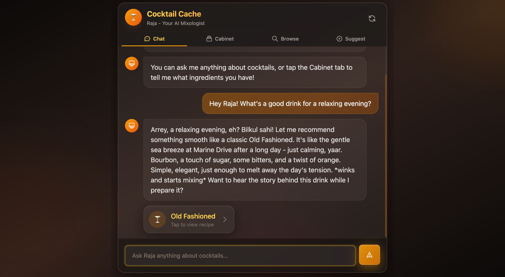
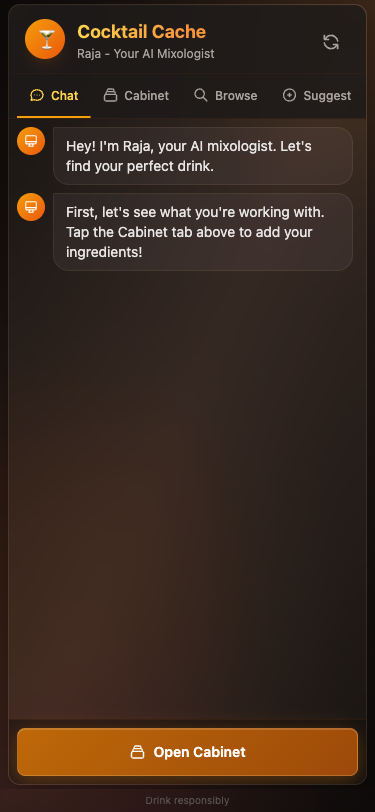
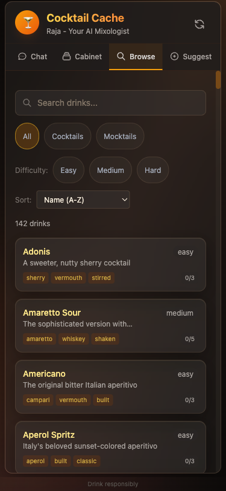
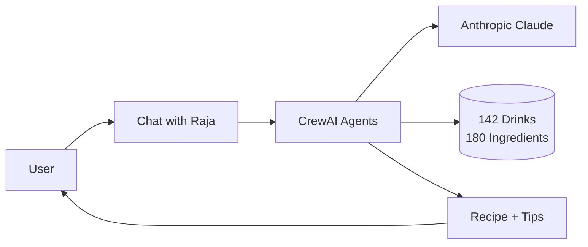

# Cocktail Cache

> **Your cabinet. Your mood. Your perfect drink.**

<p align="center">
  <a href="https://cocktail-cache.onrender.com">
    
  </a>
</p>

<p align="center">
  <a href="https://github.com/darth-dodo/cocktail-cache">
    
  </a>
  
  
  
</p>

---

An AI-powered home bar advisor that helps you craft great cocktails with whatever bottles you have. Chat with Raja, your AI mixologist, to get personalized drink recommendations, technique guidance, and smart suggestions for your next bottle purchase.

---

## Meet Raja, Your AI Mixologist

<p align="center">
  
</p>

**Raja** is a 20-year bartender veteran from Colaba, Bombay. He knows his craft, tells great stories, and speaks with warmth:

> *"Arrey bhai! Feeling relaxed after a long day? With your bourbon and lemons, let me suggest a Gold Rush — ekdum first class for unwinding!"*

Just tell Raja what you have and how you're feeling. He'll find the perfect drink.

---

## How It Works

### 1. Tell Raja What You Have
Add your bottles to your cabinet — spirits, mixers, bitters, fresh ingredients. Your cabinet is saved automatically.

### 2. Describe Your Mood
"Celebrating a promotion" • "Quiet evening alone" • "Cocktail nights with friends" • "Sunday afternoon vibes"

### 3. Get Your Perfect Drink
Raja recommends drinks you can actually make, with step-by-step instructions adapted to your skill level.

### 4. Know What to Buy Next
Raja tells you which single bottle will unlock the most new drinks — maximum impact for your next purchase.

---

## Features

| Feature | Description |
|---------|-------------|
| **142 Drinks** | 103 cocktails + 39 mocktails with detailed recipes |
| **Smart Matching** | Only shows drinks you can make with your cabinet |
| **Skill Adaptation** | Beginner-friendly to adventurous techniques |
| **Next Bottle Advice** | ROI-based suggestions for cabinet expansion |
| **Browse & Search** | Explore the full catalog with filters |
| **Mobile-First** | Designed for use in the kitchen |

---

## Screenshots

<p align="center">
  
  
  
</p>

<p align="center">
  <em>Chat with Raja • Build Your Cabinet • Browse All Drinks</em>
</p>

---

## Try It Now

**[cocktail-cache.onrender.com](https://cocktail-cache.onrender.com)**

No signup required. Just start chatting with Raja.

---

## For Developers

<details>
<summary><strong>Tech Stack & Architecture</strong></summary>

### Tech Stack

| Component | Technology |
|-----------|------------|
| **Runtime** | Python 3.12 |
| **API** | FastAPI |
| **AI** | CrewAI + Anthropic Claude |
| **Frontend** | HTMX + Jinja2 + Tailwind |
| **Deployment** | Render |

### Codebase Health

| Metric | Value |
|--------|-------|
| **Test Suite** | 714 tests |
| **Code Coverage** | 78% |
| **Models** | 100% covered |
| **Services** | 96%+ covered |
| **Type Checking** | Strict mypy |
| **Linting** | Ruff + pre-commit hooks |

### Quick Start

```bash
git clone https://github.com/darth-dodo/cocktail-cache.git
cd cocktail-cache

cp .env.example .env
# Add your ANTHROPIC_API_KEY

make install
make dev
# Visit http://localhost:8888
```

### Architecture



### AI Agents

- **Raja Bartender** — Conversational AI with Bombay personality
- **Drink Recommender** — Matches cabinet + mood to drinks
- **Recipe Writer** — Generates skill-adapted instructions
- **Bottle Advisor** — Calculates next bottle ROI

### Documentation

- [Architecture](docs/architecture.md) — System design
- [Product Requirements](docs/product.md) — PRD and user stories
- [API Reference](docs/api.md) — REST endpoints

</details>

<details>
<summary><strong>Development Commands</strong></summary>

| Command | Description |
|---------|-------------|
| `make install` | Install dependencies |
| `make dev` | Start dev server (port 8888) |
| `make test` | Run test suite |
| `make check` | Linting and type checks |
| `make format` | Format code |

</details>

---

## Contributing

1. Fork the repository
2. Create a feature branch (`git checkout -b feature/amazing-feature`)
3. Commit your changes
4. Push and open a Pull Request

---

## License

MIT License — see [LICENSE](LICENSE) for details.

---

<p align="center">
  <strong>Built with</strong><br/>
  <a href="https://crewai.com">CrewAI</a> •
  <a href="https://anthropic.com">Anthropic Claude</a> •
  <a href="https://fastapi.tiangolo.com">FastAPI</a> •
  <a href="https://htmx.org">HTMX</a>
</p>

<p align="center">
  <a href="https://cocktail-cache.onrender.com"><strong>Try it Live →</strong></a>
</p>
