# Cocktail Cache - Architecture Diagrams

> Visual representations of system architecture, data flow, and component interactions using Mermaid diagrams.

---

## 1. High-Level System Architecture

---

## 2. Request/Response Flow

---

## 3. CrewAI Agent Architecture

---

## 4. Agent Details

```mermaid
flowchart LR
    subgraph CA["Cabinet Analyst"]
        CA_in["Input:<br/>• cabinet[]<br/>• drink_type<br/>• skill_level<br/>• exclude[]"]
        CA_out["Output:<br/>• candidates[]<br/>• match_scores<br/>• difficulty<br/>• is_mocktail"]
        CA_tool["Tool: RecipeDB"]
    end

    subgraph MM["Mood Matcher"]
        MM_in["Input:<br/>• mood<br/>• constraints[]<br/>• candidates[]<br/>• skill_level"]
        MM_out["Output:<br/>• ranked[]<br/>• why (explanation)<br/>• flavor_profiles"]
        MM_tool["Tool: FlavorProfiler"]
    end

    subgraph RW["Recipe Writer"]
        RW_in["Input:<br/>• cocktail_id<br/>• user_cabinet<br/>• skill_level"]
        RW_out["Output:<br/>• full recipe<br/>• skill-adapted tips<br/>• substitutions"]
        RW_tool["Tools: RecipeDB,<br/>SubstitutionFinder"]
    end

    subgraph BA["Bottle Advisor"]
        BA_in["Input:<br/>• cabinet[]<br/>• preferred_profiles"]
        BA_out["Output:<br/>• best bottle<br/>• unlocks[]<br/>• price range<br/>• runner-up"]
        BA_tool["Tool: UnlockCalculator"]
    end
```

---

## 5. Data Architecture

---

## 6. Data Models

---

## 7. UI Component Architecture

---

## 8. Recipe Card Component

```mermaid
flowchart TB
    subgraph RecipeCard["recipe_card.html"]
        Header["Header: Name + Badges<br/>[EASY] [🍸 COCKTAIL]"]
        Tagline["Tagline"]
        Why["Why This Drink section"]

        subgraph TwoCol["Two Column Layout"]
            Flavor["Flavor Profile Chart<br/>Sweet/Sour/Bitter/Spirit bars"]
            Ingredients["Ingredients List<br/>with amounts"]
        end

        Method["Step-by-step Method<br/>with technique tips"]

        subgraph Actions["Action Buttons"]
            Another["Show Me Another"]
            Made["I Made This ✓"]
        end

        NextBottle["Next Bottle Recommendation<br/>with unlock list"]
    end

    Header --> Tagline --> Why --> TwoCol --> Method --> Actions --> NextBottle
```

---

## 9. State Machine - User Session

---

## 10. Flow State Transitions

```mermaid
stateDiagram-v2
    direction LR

    [*] --> ReceiveInput

    ReceiveInput --> Analyze: State initialized
    note right of ReceiveInput
        Sets:
        • session_id
        • cabinet
        • mood
        • drink_type
        • skill_level
        • recent_history
    end note

    Analyze --> GenerateRecipe: Crew 1 complete
    note right of Analyze
        Sets:
        • candidates[]
        • selected
    end note

    GenerateRecipe --> Complete: Crew 2 complete
    note right of GenerateRecipe
        Sets:
        • recipe
        • next_bottle
    end note

    Complete --> [*]
```

---

## 11. Deployment Architecture

---

## 12. Performance Budget

---

## 13. Tool Dependencies

---

## 14. Local Storage Schema

---

## 15. API Endpoints

---

## 16. Directory Structure

---

*Diagrams Version: 2.0 (Mermaid)*
*Last Updated: 2025-12-27*
