# Cocktail Cache: Crash Course

**Version**: 2.1 | **Tests**: 761 | **Coverage**: 78% | **Date**: December 2025

---

## Executive Summary

This crash course documents everything about **Cocktail Cache** — an AI-powered drink advisor using multi-agent orchestration. Chat with Raja, your AI bartender from Bombay, to get personalized drink recommendations based on your cabinet and mood.

### What We Built

```
┌─────────────────────────────────────────────────────────────────┐
│                      COCKTAIL CACHE                             │
├─────────────────────────────────────────────────────────────────┤
│  Frontend: HTMX + Jinja2 + Tailwind (glassmorphic UI)          │
│  Backend: FastAPI with session management                       │
│  AI System: CrewAI with 7 agents, 4 crews, 4 tools             │
│  LLM: Anthropic Claude Haiku (all agents)                      │
│  Config: YAML-based agent/task/LLM definitions                  │
│  Data: 142 drinks (103 cocktails + 39 mocktails)               │
│  Deployment: Docker + Render.com                                │
└─────────────────────────────────────────────────────────────────┘
```

### Key Achievements

- ✅ Multi-agent recommendation pipeline with parallel crew execution
- ✅ Conversational Raja persona with Hindi-English personality
- ✅ Cabinet analysis with ingredient matching and unlock scoring
- ✅ Mood-based drink ranking and skill-adapted recipes
- ✅ "Next bottle" recommendations with ROI calculations
- ✅ Session-based chat with conversation history
- ✅ Mobile-first glassmorphic UI with tab navigation
- ✅ 761 tests with 78% coverage, strict typing
- ✅ Tool-based architecture: Raja uses 4 cocktail tools dynamically

---

## Table of Contents

1. [Architecture Overview](#1-architecture-overview)
2. [Technology Stack](#2-technology-stack)
3. [Project Structure](#3-project-structure)
4. [Agent System](#4-agent-system)
5. [Crew Orchestration](#5-crew-orchestration)
6. [Flow Pipeline](#6-flow-pipeline)
7. [Tool System](#7-tool-system)
8. [API Design](#8-api-design)
9. [Session Management](#9-session-management)
10. [Frontend Architecture](#10-frontend-architecture)
11. [Testing Strategy](#11-testing-strategy)
12. [Development Workflow](#12-development-workflow)
13. [Patterns & Best Practices](#13-patterns--best-practices)
14. [Deployment](#14-deployment)
15. [Quick Reference](#15-quick-reference)

---

## 1. Architecture Overview

### High-Level Flow


### Multi-Agent Pipeline


### Design Decisions

| Decision | Choice | Rationale |
|----------|--------|-----------|
| Agent Framework | CrewAI | Native Claude support, typed I/O, flows |
| LLM Strategy | Haiku for all agents | Fast, cost-effective |
| Config System | YAML + Pydantic | Declarative + validated |
| Session Storage | In-memory dict | MVP simplicity |
| Frontend | HTMX + Jinja2 | No build step, server-driven |
| Crew Execution | Parallel when possible | 40% latency reduction |

---

## 2. Technology Stack

### Backend

| Technology | Version | Purpose |
|------------|---------|---------|
| Python | 3.12 | Runtime |
| FastAPI | ≥0.115 | Web framework |
| CrewAI | ≥0.86 | Agent orchestration |
| Anthropic | ≥0.42 | Claude API |
| Pydantic | ≥2.10 | Data validation |
| uvicorn | ≥0.34 | ASGI server |

### Frontend

| Technology | Purpose |
|------------|---------|
| HTMX | Dynamic HTML updates |
| Jinja2 | Server-side templating |
| Tailwind CSS | Utility-first styling |
| Alpine.js | Minimal reactivity |

### DevOps

| Technology | Purpose |
|------------|---------|
| Docker | Containerization |
| uv | Fast package management |
| ruff | Linting + formatting |
| mypy | Type checking |
| pytest | Testing framework |
| pre-commit | Git hooks |

---

## 3. Project Structure

```
cocktail-cache/
├── src/app/
│   ├── main.py                    # FastAPI entry + page routes
│   ├── config.py                  # Pydantic Settings
│   ├── rate_limit.py              # Request throttling
│   │
│   ├── agents/                    # Agent factory functions
│   │   ├── config/
│   │   │   ├── agents.yaml        # Role, goal, backstory
│   │   │   ├── tasks.yaml         # Task templates
│   │   │   └── llm.yaml           # Model profiles
│   │   ├── raja_bartender.py      # create_raja_bartender()
│   │   ├── drink_recommender.py   # create_drink_recommender()
│   │   ├── recipe_writer.py       # create_recipe_writer()
│   │   ├── bottle_advisor.py      # create_bottle_advisor()
│   │   └── llm_config.py          # get_llm(profile)
│   │
│   ├── crews/                     # Crew compositions
│   │   ├── analysis_crew.py       # Cabinet + mood analysis
│   │   ├── recipe_crew.py         # Recipe + bottle advice
│   │   ├── raja_chat_crew.py      # Conversational chat
│   │   └── bar_growth_crew.py     # Purchase recommendations
│   │
│   ├── flows/                     # Multi-crew orchestration
│   │   └── cocktail_flow.py       # CocktailFlow pipeline
│   │
│   ├── tools/                     # Deterministic data tools
│   │   ├── recipe_db.py           # RecipeDBTool
│   │   ├── unlock_calculator.py   # UnlockCalculatorTool
│   │   ├── flavor_profiler.py     # FlavorProfilerTool
│   │   └── substitution_finder.py # SubstitutionFinderTool
│   │
│   ├── models/                    # Pydantic models
│   │   ├── crew_io.py             # AnalysisInput/Output, RecipeInput/Output
│   │   ├── chat.py                # ChatMessage, ChatSession, RajaChatOutput
│   │   ├── drinks.py              # Drink, Ingredient, FlavorProfile
│   │   ├── recipe.py              # RecipeIngredient, RecipeStep
│   │   └── config.py              # AgentConfig, LLMConfig, TaskConfig
│   │
│   ├── services/                  # Data loading + caching
│   │   ├── data_loader.py         # load_all_drinks(), load_cocktails()
│   │   └── drink_data.py          # get_makeable_drinks(), format helpers
│   │
│   ├── routers/                   # Modular API endpoints
│   │   ├── api.py                 # Router aggregation + health check
│   │   ├── flow.py                # /api/flow recommendation pipeline
│   │   ├── chat.py                # /api/chat Raja conversation
│   │   ├── drinks.py              # /api/drinks catalog endpoints
│   │   └── bottles.py             # /api/suggest-bottles recommendations
│   │
│   ├── utils/                     # Shared utilities
│   │   └── parsing.py             # Common request/response parsing
│   │
│   ├── templates/                 # Jinja2 templates
│   │   ├── base.html
│   │   ├── index.html             # Main chat interface
│   │   ├── browse.html            # Drink catalog
│   │   └── drink.html             # Drink detail
│   │
│   └── static/
│       ├── css/glassmorphic.css   # Custom glass effect styles
│       └── js/
│           ├── tab-manager.js     # Tab navigation
│           ├── cabinet-state.js   # Ingredient selection
│           └── chat-state.js      # Chat functionality
│
├── tests/                         # Mirror src/ structure
│   ├── conftest.py                # Shared fixtures
│   ├── agents/
│   ├── crews/
│   ├── flows/
│   ├── models/
│   └── routers/
│
├── data/                          # JSON data files
│   ├── cocktails.json             # 103 cocktails
│   ├── mocktails.json             # 39 mocktails
│   ├── ingredients.json           # 180+ ingredients
│   ├── unlock_scores.json         # Pre-computed unlock values
│   └── substitutions.json         # Ingredient swaps
│
└── docs/
    ├── BLUEPRINT.md               # Architecture patterns
    ├── CRASH-COURSE.md            # This document
    ├── architecture.md            # System design
    └── api.md                     # API reference
```

---

## 4. Agent System

### Agent Factory Pattern

All agents use factory functions that load config from YAML:

```python
# src/app/agents/raja_bartender.py
from crewai import LLM, Agent
from src.app.agents.config import get_agent_config
from src.app.agents.llm_config import get_llm

def create_raja_bartender(
    tools: list | None = None,
    llm: LLM | None = None,
) -> Agent:
    """Create Raja Bartender conversational agent."""
    config = get_agent_config("raja_bartender")

    return Agent(
        role=config.role,
        goal=config.goal,
        backstory=config.backstory,
        tools=tools or [],
        llm=llm or get_llm(profile="conversational"),
        verbose=config.verbose,
        allow_delegation=config.allow_delegation,
    )
```

### Agent Configurations

```yaml
# src/app/agents/config/agents.yaml
raja_bartender:
  role: "Raja - Your Bombay Bartender"
  goal: "Have snappy, personality-rich conversations about cocktails"
  backstory: |
    You are Raja, a bartender from Colaba, Bombay. You speak warm Hindi-English
    - use "yaar", "bhai", "acha", "bilkul", "of course".

    IMPORTANT - STORYTELLING RULE: NEVER share first-person stories.
    Always share SECOND-HAND stories - "I heard from an old customer that..."

    Keep responses SNAPPY - 2-3 sentences max unless explaining a recipe.
  verbose: false
  allow_delegation: false

drink_recommender:
  role: "Drink Recommender"
  goal: "Find and rank the best drinks based on available ingredients and mood"
  backstory: |
    You are an expert mixologist and mood sommelier rolled into one.
    You instantly know which drinks can be made from a home bar cabinet,
    and you deeply understand the emotional connection between drinks and moods.
  verbose: false
  allow_delegation: false
```

### LLM Profiles

```yaml
# src/app/agents/config/llm.yaml
default:
  model: "anthropic/claude-3-5-haiku-latest"
  temperature: 0.7
  max_tokens: 1024

fast:
  model: "anthropic/claude-3-5-haiku-latest"
  temperature: 0.5
  max_tokens: 1024

creative:
  model: "anthropic/claude-3-5-haiku-20241022"
  temperature: 0.9
  max_tokens: 2048

precise:
  model: "anthropic/claude-3-5-haiku-latest"
  temperature: 0.3
  max_tokens: 1024

conversational:
  model: "anthropic/claude-3-5-haiku-20241022"
  temperature: 0.85
  max_tokens: 1024
```

### Agent Inventory

| Agent | Role | LLM Profile | Used In |
|-------|------|-------------|---------|
| `drink_recommender` | Find + rank drinks | default (Haiku) | AnalysisCrew |
| `cabinet_analyst` | Identify makeable drinks | default (Haiku) | AnalysisCrew (full) |
| `mood_matcher` | Rank drinks by mood fit | default (Haiku) | AnalysisCrew (full) |
| `recipe_writer` | Generate recipes | default (Haiku) | RecipeCrew |
| `bottle_advisor` | Next purchase advice | default (Haiku) | RecipeCrew |
| `raja_bartender` | Conversational chat | conversational (Haiku) | RajaChatCrew |
| `bar_growth_advisor` | Strategic bar growth | default (Haiku) | BarGrowthCrew |

---

## 5. Crew Orchestration

### Crew Pattern

Crews compose agents with tasks and process configuration:

```python
# src/app/crews/analysis_crew.py
from crewai import Crew, Process, Task
from src.app.agents import create_drink_recommender
from src.app.agents.config import get_task_config
from src.app.models import AnalysisOutput

def create_analysis_crew() -> Crew:
    """Create crew for cabinet analysis and mood matching."""
    recommender = create_drink_recommender()
    task_config = get_task_config("unified_analysis")

    analysis_task = Task(
        description=task_config.description,
        expected_output=task_config.expected_output,
        agent=recommender,
        output_pydantic=AnalysisOutput,  # Typed output!
    )

    return Crew(
        agents=[recommender],
        tasks=[analysis_task],
        process=Process.sequential,
        verbose=False,
    )
```

### Crew Inventory


| Crew | Agents | Purpose | Execution |
|------|--------|---------|-----------|
| `AnalysisCrew` | drink_recommender | Find makeable drinks, rank by mood | Sequential |
| `RecipeCrew` | recipe_writer, bottle_advisor | Generate recipe + purchase advice | Parallel |
| `RajaChatCrew` | raja_bartender | Conversational interaction | Sequential |
| `BarGrowthCrew` | bar_growth_advisor | Strategic bar recommendations | Sequential |

### Tool-Based Architecture (Raja Chat)

Raja now uses 4 cocktail tools for dynamic data access:

```python
# Raja agent is created with default tools
raja = create_raja_bartender()  # Has 4 tools by default

# Tools available:
# - recipe_database: Search drinks by cabinet ingredients
# - substitution_finder: Find ingredient alternatives
# - unlock_calculator: Calculate best bottles to buy
# - flavor_profiler: Compare drink flavor profiles

# Raja dynamically calls tools during conversation
# No need to pre-inject full drink database
```

**Benefits**:
- Smaller prompts (~1000 vs ~4000 tokens per message)
- Dynamic data: Raja queries only what's needed
- More natural UX: "Let me check..." feels authentic

### Data Injection Pattern (Other Crews)

For non-chat crews, we still pre-compute data and inject into prompts:

```python
# Pre-compute before crew kickoff
makeable_drinks = get_makeable_drinks(cabinet, drink_type)
available_drinks_text = format_drinks_for_prompt(makeable_drinks)

# Inject via kickoff inputs
result = crew.kickoff(inputs={
    "cabinet": cabinet,
    "mood": mood,
    "available_drinks": available_drinks_text,  # Pre-computed!
})
```

**Why**: Eliminates tool call overhead for batch operations.

---

## 6. Flow Pipeline

### CocktailFlow Architecture


The flow orchestrates multiple crews with state management:

```python
# src/app/flows/cocktail_flow.py
from crewai.flow.flow import Flow, listen, start
from pydantic import BaseModel

class CocktailFlowState(BaseModel):
    """State container for the recommendation pipeline."""
    session_id: str
    cabinet: list[str]
    mood: str
    skill_level: str = "intermediate"
    drink_type: str = "cocktail"

    # Crew outputs (structured)
    analysis: AnalysisOutput | None = None
    recipe: RecipeOutput | None = None
    bottle_advice: BottleAdvisorOutput | None = None
    error: str | None = None

class CocktailFlow(Flow[CocktailFlowState]):
    """Main orchestration flow."""

    @start()
    def receive_input(self) -> CocktailFlowState:
        """Entry point: validate and normalize input."""
        if not self.state.cabinet:
            self.state.error = "Cabinet is empty."
        return self.state

    @listen(receive_input)
    def analyze(self) -> CocktailFlowState:
        """Run Analysis Crew."""
        if self.state.error:
            return self.state

        crew = create_analysis_crew()
        result = crew.kickoff(inputs={...})
        self.state.analysis = result.pydantic
        return self.state

    @listen(analyze)
    async def generate_recipe(self) -> CocktailFlowState:
        """Run Recipe Crew (parallel or sequential)."""
        if settings.PARALLEL_CREWS:
            await self._generate_parallel()
        else:
            await self._generate_sequential()
        return self.state
```

### Flow Execution

```python
# Usage
async def run_cocktail_flow(
    cabinet: list[str],
    mood: str,
    skill_level: str = "intermediate",
) -> CocktailFlowState:
    flow = CocktailFlow()
    await flow.kickoff_async(inputs={
        "cabinet": cabinet,
        "mood": mood,
        "skill_level": skill_level,
    })
    return flow.state
```

### Parallel Crew Execution

```python
async def _generate_parallel(self) -> None:
    """Run Recipe Writer and Bottle Advisor in parallel."""
    recipe_crew = create_recipe_only_crew()
    bottle_crew = create_bottle_only_crew()

    results = await asyncio.gather(
        recipe_crew.kickoff_async(inputs={...}),
        bottle_crew.kickoff_async(inputs={...}),
        return_exceptions=True,
    )

    recipe_result, bottle_result = results
    # Handle each result individually...
```

---

## 7. Tool System

### Tool-Based Architecture

All 4 cocktail tools are now integrated with Raja's agent for dynamic data access:

```python
# src/app/agents/raja_bartender.py
DEFAULT_RAJA_TOOLS = [
    RecipeDBTool(),           # Search drinks by ingredients
    SubstitutionFinderTool(), # Find ingredient alternatives
    UnlockCalculatorTool(),   # Calculate best bottles to buy
    FlavorProfilerTool(),     # Analyze/compare drink flavors
]

def create_raja_bartender(include_default_tools: bool = True) -> Agent:
    all_tools = DEFAULT_RAJA_TOOLS if include_default_tools else []
    return Agent(tools=all_tools, ...)
```

### Tool Inventory

| Tool | Purpose | Raja Uses For |
|------|---------|---------------|
| `RecipeDBTool` | Find makeable drinks | "What can I make with my cabinet?" |
| `SubstitutionFinderTool` | Find ingredient swaps | "I don't have bourbon, what can I use?" |
| `UnlockCalculatorTool` | Calculate unlock value | "What bottle should I buy next?" |
| `FlavorProfilerTool` | Analyze drink flavors | "How does a Negroni taste?" |

### Tool Output Formatting

Tools return Raja-friendly conversational responses:

```python
# src/app/tools/recipe_db.py
class RecipeDBTool(BaseTool):
    name: str = "recipe_database"
    description: str = (
        "Search Raja's drink database. Returns drinks with match scores."
    )

    def _run(self, cabinet: list[str], drink_type: str = "both") -> str:
        matches = self._find_matches(cabinet, drink_type)
        # Returns structured JSON that Raja can interpret
        return json.dumps({"matches": matches[:10], "total": len(matches)})
```

### Data Service Pattern (Non-Chat)

For batch operations in other crews, we still use direct data injection:

```python
# src/app/services/drink_data.py
def get_makeable_drinks(
    cabinet: list[str],
    drink_type: DrinkTypeFilter = "both",
) -> list[dict]:
    """Get drinks makeable with cabinet (for prompt injection)."""
    return [drink for drink in load_drinks() if matches_cabinet(drink, cabinet)]
```

---

## 8. API Design

### Request Flow


### Endpoints Summary

| Method | Endpoint | Purpose |
|--------|----------|---------|
| GET | `/health` | Health check |
| GET | `/` | Main chat interface |
| GET | `/browse` | Drink catalog |
| GET | `/drink/{id}` | Drink detail page |
| POST | `/api/flow` | Run recommendation flow |
| POST | `/api/chat` | Chat with Raja |
| GET | `/api/chat/{session_id}/history` | Get chat history |
| DELETE | `/api/chat/{session_id}` | End chat session |
| GET | `/api/drinks` | List all drinks |
| GET | `/api/drinks/{id}` | Get drink details |
| GET | `/api/ingredients` | List all ingredients |
| POST | `/api/suggest-bottles` | Get bottle recommendations |

### Flow Request/Response

```python
# Request
class FlowRequest(BaseModel):
    action: FlowAction  # "start" | "another" | "made"
    cabinet: list[str] = []
    mood: str = ""
    skill_level: str = "intermediate"
    drink_type: str = "cocktail"
    session_id: str | None = None

# Response
class FlowResponse(BaseModel):
    session_id: str
    selected_drink: str | None
    recipe: RecipeData | None
    bottle_recommendation: BottleRecData | None
    candidates: list[dict]
    error: str | None
```

### Chat Request/Response

```python
# Request
class ChatRequest(BaseModel):
    message: str
    session_id: str | None = None
    cabinet: list[str] | None = None
    skill_level: str | None = None
    drink_type: str | None = None

# Response
class ChatResponse(BaseModel):
    session_id: str
    message_id: str
    content: str
    drinks_mentioned: list[DrinkReference]
    ingredients_mentioned: list[str]
    suggested_action: str | None
    recommendation_offered: bool
    recommended_drink_id: str | None
    special_recipe: SpecialRecipe | None
```

---

## 9. Session Management

### Chat Session Architecture


```python
# src/app/crews/raja_chat_crew.py
from datetime import datetime
from src.app.models.chat import ChatSession, ChatMessage, MessageRole

# In-memory session store
_chat_sessions: dict[str, ChatSession] = {}

def get_or_create_session(
    session_id: str | None,
    cabinet: list[str] | None = None,
    skill_level: str | None = None,
) -> ChatSession:
    """Get existing session or create new one."""
    if session_id and session_id in _chat_sessions:
        session = _chat_sessions[session_id]
        session.last_active = datetime.utcnow()
        return session

    # Create new session with greeting
    new_session = ChatSession(
        session_id=str(uuid.uuid4()),
        cabinet=cabinet or [],
        skill_level=skill_level or "intermediate",
    )

    greeting = ChatMessage(
        role=MessageRole.RAJA,
        content="Arrey yaar, welcome! Raja here. What's the mood today?",
    )
    new_session.history.add_message(greeting)

    _chat_sessions[new_session.session_id] = new_session
    return new_session
```

### Session State Model

```python
class ChatSession(BaseModel):
    """Chat session with conversation history."""
    session_id: str
    cabinet: list[str] = []
    skill_level: str = "intermediate"
    drink_type_preference: str = "cocktail"
    current_mood: str | None = None
    last_recommended_drink: str | None = None
    mentioned_drinks: list[str] = []
    mentioned_ingredients: list[str] = []
    history: ConversationHistory = Field(default_factory=ConversationHistory)
    created_at: datetime = Field(default_factory=datetime.utcnow)
    last_active: datetime = Field(default_factory=datetime.utcnow)
```

### Context Building for LLM

```python
def format_for_prompt(self, last_n: int = 8) -> str:
    """Format conversation history for LLM context."""
    messages = self.messages[-last_n:]
    lines = []
    for msg in messages:
        role = "Customer" if msg.role == MessageRole.USER else "Raja"
        lines.append(f"{role}: {msg.content}")
    return "\n".join(lines)
```

---

## 10. Frontend Architecture

### Technology Stack

| Component | Technology | Purpose |
|-----------|------------|---------|
| Templating | Jinja2 | Server-side HTML |
| Styling | Tailwind CSS | Utility classes |
| Updates | HTMX | Dynamic content without JS |
| State | Alpine.js | Minimal client reactivity |
| Effects | glassmorphic.css | Glass-morphism effects |

### Tab Navigation System

```html
<!-- Three-tab mobile-first interface -->
<div class="tab-container">
    <button data-tab="chat" class="tab-btn active">Chat</button>
    <button data-tab="cabinet" class="tab-btn">Cabinet</button>
    <button data-tab="browse" class="tab-btn">Browse</button>
</div>

<div id="chat-panel" class="tab-panel active">...</div>
<div id="cabinet-panel" class="tab-panel">...</div>
<div id="browse-panel" class="tab-panel">...</div>
```

### HTMX Patterns

```html
<!-- Chat form with HTMX -->
<form hx-post="/api/chat"
      hx-target="#chat-messages"
      hx-swap="beforeend"
      hx-indicator="#chat-loading">
    <input type="hidden" name="session_id" id="session-id">
    <input type="text" name="message" placeholder="Ask Raja...">
    <button type="submit">Send</button>
</form>

<!-- Loading indicator -->
<div id="chat-loading" class="htmx-indicator">
    <div class="typing-indicator">...</div>
</div>
```

### Glassmorphic UI

```css
/* src/app/static/css/glassmorphic.css */
.glass-card {
    background: rgba(28, 25, 23, 0.7);
    backdrop-filter: blur(12px);
    border: 1px solid rgba(255, 255, 255, 0.1);
    border-radius: 1rem;
}

.glass-btn-primary {
    background: linear-gradient(
        135deg,
        rgba(245, 158, 11, 0.3),
        rgba(217, 119, 6, 0.4)
    );
    border: 1px solid rgba(245, 158, 11, 0.5);
}
```

---

## 11. Testing Strategy

### Test Pyramid


### Test Categories

| Category | Count | Focus |
|----------|-------|-------|
| Models | 200+ | Pydantic validation, serialization |
| Services | 150+ | Data loading, filtering, formatting |
| Tools | 50+ | Deterministic data operations |
| Crews | 100+ | Agent composition, mocked LLM |
| Flows | 50+ | Pipeline orchestration |
| API | 100+ | Endpoints, error handling |

### Mock LLM Pattern

```python
# tests/conftest.py
import os
os.environ["ANTHROPIC_API_KEY"] = "test-key"  # Before imports!

import pytest
from unittest.mock import patch, MagicMock

@pytest.fixture
def mock_crew_result():
    """Mock CrewAI crew result."""
    mock = MagicMock()
    mock.pydantic = AnalysisOutput(
        candidates=[DrinkCandidate(id="manhattan", name="Manhattan")],
        total_found=1,
    )
    return mock

# Usage in tests
@patch("src.app.crews.analysis_crew.Crew")
def test_analysis_crew(mock_crew_class, mock_crew_result):
    mock_crew_class.return_value.kickoff.return_value = mock_crew_result
    # Test crew behavior, not LLM
```

### Coverage Targets

| Layer | Target | Current |
|-------|--------|---------|
| Models | 100% | 100% |
| Services | 95%+ | 96% |
| Tools | 90%+ | 92% |
| Crews | 80%+ | 85% |
| Overall | 70%+ | 78% |

---

## 12. Development Workflow

### Makefile Commands

```bash
# Development
make install          # Install dependencies (uv sync)
make dev              # Start server (port 8888)

# Quality
make test             # Run test suite with coverage
make lint             # Check code style (ruff)
make format           # Auto-fix style
make typecheck        # Run mypy
make check            # All quality gates

# Docker
make docker-build     # Build image
make docker-run       # Run container
```

### TDD Cycle

```mermaid
graph LR
    RED["🔴 RED<br/>Write failing test"] --> GREEN["🟢 GREEN<br/>Minimal impl"]
    GREEN --> REFACTOR["🔵 REFACTOR<br/>Clean up"]
    REFACTOR --> RED

    style RED fill:#ffcccc
    style GREEN fill:#ccffcc
    style REFACTOR fill:#ccccff
```



```bash
# 1. RED: Write failing test
make test-fast  # Stop on first failure

# 2. GREEN: Minimal implementation
make test-fast  # Should pass

# 3. REFACTOR: Clean up
make check      # All quality gates
git add . && git commit
```

### Pre-commit Hooks

```yaml
# .pre-commit-config.yaml
repos:
  - repo: https://github.com/astral-sh/ruff-pre-commit
    hooks:
      - id: ruff
        args: [--fix]
      - id: ruff-format
  - repo: local
    hooks:
      - id: mypy
        entry: uv run mypy src
```

---

## 13. Patterns & Best Practices

### 1. Factory Pattern for Agents

```python
def create_drink_recommender(
    tools: list | None = None,
    llm: LLM | None = None,
) -> Agent:
    config = get_agent_config("drink_recommender")
    return Agent(
        role=config.role,
        goal=config.goal,
        backstory=config.backstory,
        tools=tools or [],
        llm=llm or get_llm(),
    )
```

**Why**: Separates config from creation, enables testing with custom LLM.

### 2. Pydantic I/O for Crews

```python
class AnalysisOutput(BaseModel):
    candidates: list[DrinkCandidate]
    total_found: int = Field(ge=0)
    mood_summary: str = ""

# In task definition
task = Task(
    description=...,
    expected_output=...,
    output_pydantic=AnalysisOutput,  # Typed!
)
```

**Why**: Type safety, validation, IDE autocomplete, self-documenting.

### 3. Data Injection Over Tool Calls

```python
# ❌ Don't: Agent calls tool at runtime
agent.tools = [RecipeDBTool()]

# ✅ Do: Pre-compute and inject
drinks_data = get_makeable_drinks(cabinet)
crew.kickoff(inputs={"available_drinks": format_for_prompt(drinks_data)})
```

**Why**: 40% latency reduction, deterministic behavior.

### 4. Parallel Crew Execution

```python
# When crews are independent
results = await asyncio.gather(
    recipe_crew.kickoff_async(inputs={...}),
    bottle_crew.kickoff_async(inputs={...}),
    return_exceptions=True,
)
```

**Why**: Reduces total latency from A+B to max(A,B).

### 5. Graceful Degradation

```python
def run_raja_chat(request: ChatRequest) -> ChatResponse:
    try:
        result = crew.kickoff()
        output = _parse_raja_output(result)
    except Exception as e:
        logger.error(f"Chat failed: {e}")
        output = RajaChatOutput(
            response="Arrey, something went wrong! Try again, yaar.",
            detected_intent=MessageIntent.GENERAL_CHAT,
        )
    return ChatResponse(content=output.response, ...)
```

**Why**: API remains functional even when LLM fails.

### 6. YAML Config for Prompts

```yaml
# Prompts live in YAML, not code
raja_bartender:
  backstory: |
    You are Raja, a bartender from Colaba, Bombay...
```

**Why**: Non-engineers can tune prompts, version control tracks changes.

---

## 14. Deployment

### Docker

```dockerfile
# Dockerfile
FROM python:3.12-slim as builder
WORKDIR /app
COPY pyproject.toml README.md ./
COPY src ./src
RUN pip install build && python -m build --wheel

FROM python:3.12-slim
WORKDIR /app
COPY --from=builder /app/dist/*.whl .
RUN pip install *.whl && rm *.whl
COPY data ./data
EXPOSE 8888
CMD ["uvicorn", "src.app.main:app", "--host", "0.0.0.0", "--port", "8888"]
```

### Render.com

```yaml
# render.yaml
services:
  - type: web
    name: cocktail-cache
    runtime: python
    buildCommand: pip install -e .
    startCommand: uvicorn src.app.main:app --host 0.0.0.0 --port $PORT
    envVars:
      - key: ANTHROPIC_API_KEY
        sync: false
```

### Environment Variables

```bash
# Required
ANTHROPIC_API_KEY=sk-ant-...

# Optional
APP_ENV=production        # development | production
DEBUG=false
LOG_LEVEL=INFO
PARALLEL_CREWS=true       # Enable parallel crew execution
CREWAI_TRACING=false      # CrewAI observability
```

---

## 15. Quick Reference

### Commands

```bash
make dev          # Start server (port 8888)
make test         # Run tests with coverage
make check        # All quality gates
make format       # Auto-fix code style
```

### Key Files

```
src/app/main.py                    # FastAPI app + page routes
src/app/routers/api.py             # Router aggregation + health
src/app/routers/flow.py            # Recommendation flow endpoints
src/app/routers/chat.py            # Chat with Raja endpoints
src/app/routers/drinks.py          # Drink catalog endpoints
src/app/routers/bottles.py         # Bottle suggestion endpoints
src/app/utils/parsing.py           # Common parsing utilities
src/app/flows/cocktail_flow.py     # Main recommendation pipeline
src/app/crews/raja_chat_crew.py    # Chat with Raja
src/app/agents/config/agents.yaml  # Agent personalities
src/app/models/crew_io.py          # Pydantic I/O models
```

### API Quick Reference

```bash
# Health check
curl http://localhost:8888/health

# Start recommendation flow
curl -X POST http://localhost:8888/api/flow \
  -H "Content-Type: application/json" \
  -d '{"action":"start","cabinet":["bourbon","lemons"],"mood":"relaxing"}'

# Chat with Raja
curl -X POST http://localhost:8888/api/chat \
  -H "Content-Type: application/json" \
  -d '{"message":"What can I make tonight?","cabinet":["gin","vermouth"]}'

# List drinks
curl http://localhost:8888/api/drinks?type=cocktails

# Get bottle suggestions
curl -X POST http://localhost:8888/api/suggest-bottles \
  -H "Content-Type: application/json" \
  -d '{"cabinet":["bourbon","lemons"],"drink_type":"both"}'
```

### Environment

```bash
ANTHROPIC_API_KEY=your_key_here
APP_ENV=development
PARALLEL_CREWS=true
```

---

*Crash Course v2.1 — Cocktail Cache (761 tests, 78% coverage, Tool-Based Architecture)*
