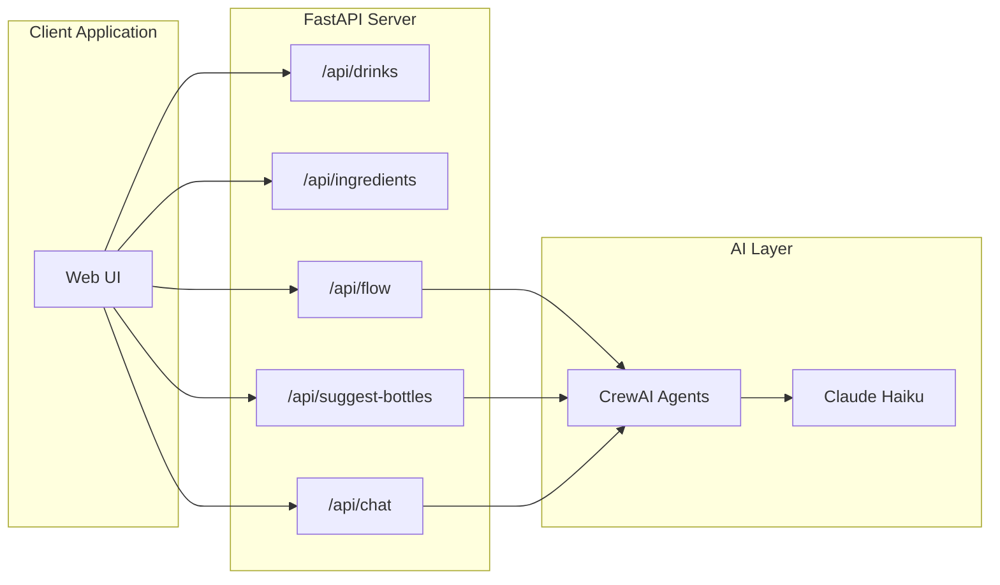
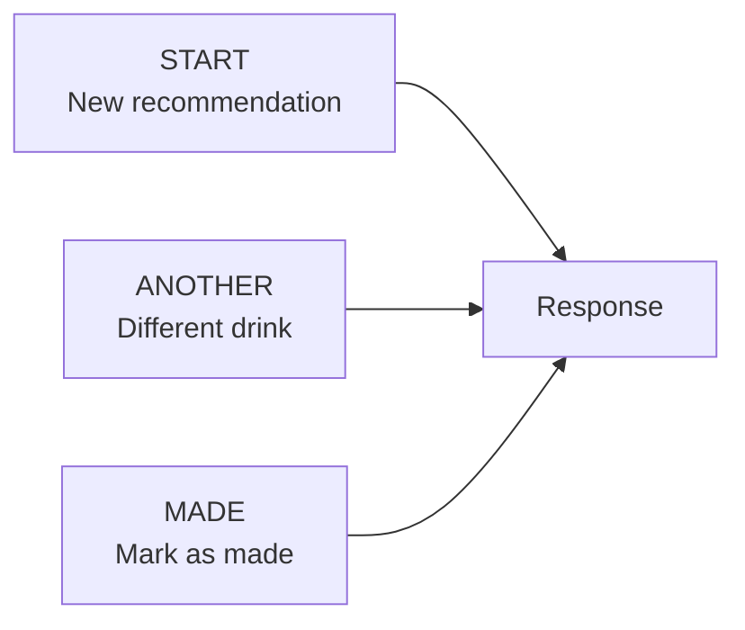
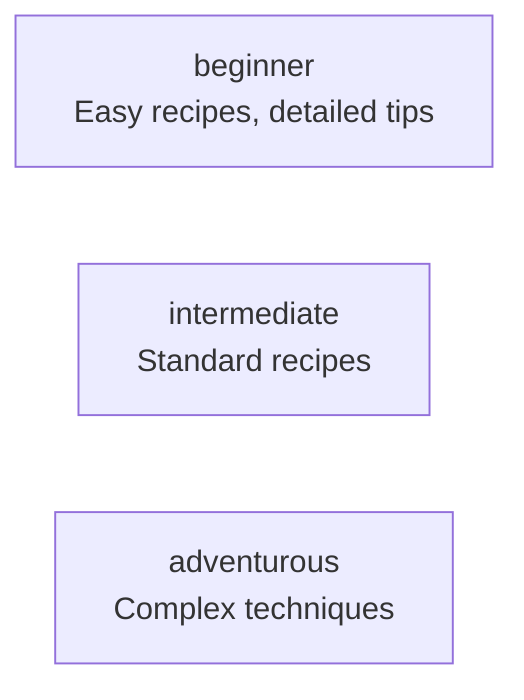
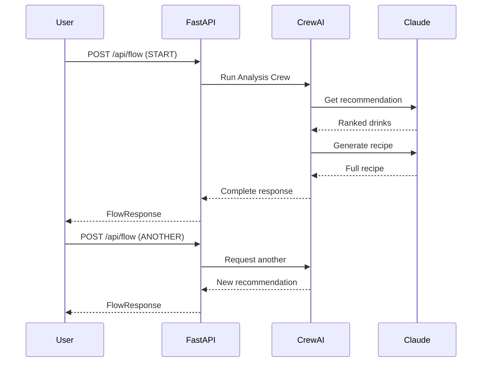

# Cocktail Cache - API Reference

> **Base URL**: `https://cocktail-cache.onrender.com/api`

Complete API documentation for Cocktail Cache's REST endpoints.

---

## Table of Contents

1. [Overview](#overview)
2. [Authentication](#authentication)
3. [Endpoints](#endpoints)
   - [Drinks](#drinks)
   - [Ingredients](#ingredients)
   - [Flow (Recommendations)](#flow-recommendations)
   - [Suggest Bottles](#suggest-bottles)
   - [Chat with Raja](#chat-with-raja)
4. [Data Models](#data-models)
5. [Error Handling](#error-handling)

---

## Overview

The Cocktail Cache API provides endpoints for:
- **Browsing** cocktails and mocktails
- **Getting AI-powered recommendations** based on your cabinet
- **Chatting with Raja**, the AI bartender
- **Finding your next bottle** to maximize drink options



---

## Authentication

The API is currently **open** and does not require authentication. Rate limiting may be applied in the future.

---

## Endpoints

### Drinks

#### GET /api/drinks

Get all available drinks for browsing.

**Response**: `DrinksResponse`

```json
{
  "drinks": [
    {
      "id": "whiskey-sour",
      "name": "Whiskey Sour",
      "tagline": "The perfect balance of booze and citrus",
      "difficulty": "easy",
      "is_mocktail": false,
      "timing_minutes": 3,
      "tags": ["whiskey", "citrus", "classic"],
      "ingredient_ids": ["bourbon", "lemon-juice", "simple-syrup"]
    }
  ],
  "total": 142
}
```

---

#### GET /api/drinks/{drink_id}

Get full details for a specific drink.

**Parameters**:
| Parameter | Type | Description |
|-----------|------|-------------|
| `drink_id` | string | Unique drink identifier (e.g., `whiskey-sour`) |

**Response**: `DrinkDetailResponse`

```json
{
  "id": "whiskey-sour",
  "name": "Whiskey Sour",
  "tagline": "The perfect balance of booze and citrus",
  "difficulty": "easy",
  "is_mocktail": false,
  "timing_minutes": 3,
  "tags": ["whiskey", "citrus", "classic"],
  "ingredients": [
    {"amount": "2", "unit": "oz", "item": "bourbon"},
    {"amount": "0.75", "unit": "oz", "item": "lemon-juice"},
    {"amount": "0.75", "unit": "oz", "item": "simple-syrup"}
  ],
  "method": [
    {"action": "Combine", "detail": "Add all ingredients to shaker"},
    {"action": "Shake", "detail": "With ice for 12-15 seconds"},
    {"action": "Strain", "detail": "Into chilled coupe or over fresh ice"}
  ],
  "glassware": "coupe",
  "garnish": "lemon twist",
  "flavor_profile": {
    "sweet": 40,
    "sour": 50,
    "bitter": 10,
    "spirit_forward": 60
  }
}
```

**Errors**:
| Code | Description |
|------|-------------|
| 404 | Drink not found |

---

### Ingredients

#### GET /api/ingredients

Get all available ingredients organized by category.

**Response**: `IngredientsResponse`

```json
{
  "categories": {
    "Spirits": [
      {"id": "bourbon", "name": "Bourbon", "emoji": "🥃"},
      {"id": "gin", "name": "Gin", "emoji": "🍸"}
    ],
    "Liqueurs & Modifiers": [
      {"id": "cointreau", "name": "Cointreau", "emoji": "🍊"},
      {"id": "campari", "name": "Campari", "emoji": "🔴"}
    ],
    "Fresh & Produce": [
      {"id": "lemon-juice", "name": "Lemon Juice", "emoji": "🍋"},
      {"id": "mint", "name": "Mint", "emoji": "🌿"}
    ]
  }
}
```

**Categories**:
| Category | Description |
|----------|-------------|
| Spirits | Base spirits (bourbon, gin, vodka, rum, etc.) |
| Liqueurs & Modifiers | Liqueurs and fortified wines |
| Bitters & Syrups | Bitters, syrups, and sweeteners |
| Fresh & Produce | Fresh fruits, herbs, and juices |
| Mixers | Sodas, tonics, and mixers |
| Non-Alcoholic | Non-alcoholic spirits |

---

### Flow (Recommendations)

#### POST /api/flow

Unified endpoint for all cocktail recommendation operations.

**Actions**:



##### START Action

Create a new flow and get a recommendation.

**Request**:

```json
{
  "action": "START",
  "cabinet": ["bourbon", "lemons", "honey", "angostura-bitters"],
  "mood": "unwinding after a long week",
  "skill_level": "intermediate",
  "drink_type": "cocktail",
  "include_bottle_advice": true
}
```

| Field | Type | Required | Description |
|-------|------|----------|-------------|
| `action` | string | Yes | Must be `"START"` |
| `cabinet` | string[] | Yes | List of ingredient IDs |
| `mood` | string | No | Description of current mood |
| `skill_level` | string | No | `beginner`, `intermediate`, or `adventurous` |
| `drink_type` | string | No | `cocktail`, `mocktail`, or `both` |
| `recent_history` | string[] | No | Drink IDs to exclude |
| `constraints` | string[] | No | Constraints like `"not too sweet"` |
| `include_bottle_advice` | boolean | No | Include next bottle suggestion (default: true) |

##### ANOTHER Action

Request a different recommendation for an existing session.

**Request**:

```json
{
  "action": "ANOTHER",
  "session_id": "abc123-def456"
}
```

| Field | Type | Required | Description |
|-------|------|----------|-------------|
| `action` | string | Yes | Must be `"ANOTHER"` |
| `session_id` | string | Yes | Session ID from previous response |

##### MADE Action

Mark a drink as made (adds to history for exclusion).

**Request**:

```json
{
  "action": "MADE",
  "session_id": "abc123-def456",
  "drink_id": "old-fashioned"
}
```

| Field | Type | Required | Description |
|-------|------|----------|-------------|
| `action` | string | Yes | Must be `"MADE"` |
| `session_id` | string | Yes | Session ID |
| `drink_id` | string | Yes | ID of the drink that was made |

**Response**: `FlowResponse`

```json
{
  "session_id": "abc123-def456",
  "success": true,
  "message": "Recommendation generated successfully",
  "recipe": {
    "id": "whiskey-sour",
    "name": "Whiskey Sour",
    "tagline": "The perfect balance of booze and citrus",
    "why": "Perfect for unwinding - the citrus brightens your evening",
    "ingredients": [
      {"amount": "2 oz", "name": "bourbon"}
    ],
    "method": [
      {"step": 1, "instruction": "Combine: Add all ingredients to shaker"}
    ],
    "glassware": "coupe",
    "garnish": "lemon twist",
    "timing": "3 minutes",
    "difficulty": "easy",
    "technique_tips": [
      {"tip": "Shake for 12-15 seconds until frost forms on shaker"}
    ],
    "is_mocktail": false,
    "flavor_profile": {"sweet": 40, "sour": 50, "bitter": 10, "spirit_forward": 60}
  },
  "next_bottle": {
    "ingredient": "sweet-vermouth",
    "ingredient_name": "Sweet Vermouth",
    "unlocks": 4,
    "drinks": ["Manhattan", "Negroni", "Boulevardier"]
  },
  "alternatives": [
    {"id": "old-fashioned", "name": "Old Fashioned", "mood_score": 85}
  ],
  "error": null
}
```

---

### Suggest Bottles

#### POST /api/suggest-bottles

Get AI-powered bottle purchase recommendations.

**Request**:

```json
{
  "cabinet": ["bourbon", "gin", "lemons"],
  "drink_type": "both",
  "limit": 5
}
```

| Field | Type | Required | Description |
|-------|------|----------|-------------|
| `cabinet` | string[] | No | Current cabinet ingredients |
| `drink_type` | string | No | `cocktails`, `mocktails`, or `both` |
| `limit` | integer | No | Max recommendations (1-20, default: 5) |

**Response**: `SuggestBottlesResponse`

```json
{
  "cabinet_size": 3,
  "drinks_makeable_now": 8,
  "recommendations": [
    {
      "ingredient_id": "campari",
      "ingredient_name": "Campari",
      "new_drinks_unlocked": 5,
      "drinks": [
        {"id": "negroni", "name": "Negroni", "is_mocktail": false, "difficulty": "easy"}
      ]
    }
  ],
  "total_available_recommendations": 15,
  "ai_summary": "Your bourbon and gin foundation is solid! Adding Campari opens up the classic Negroni family...",
  "ai_top_reasoning": "Campari is the single most impactful addition, unlocking 5 new cocktails...",
  "essentials_note": "Consider adding Angostura bitters - used in 12 of your makeable drinks",
  "next_milestone": "With 2 more bottles, you'll hit 20 cocktails!",
  "missing_essentials": [
    {"ingredient_id": "angostura-bitters", "ingredient_name": "Angostura Bitters", "used_in_drinks": 12}
  ]
}
```

---

### Chat with Raja

#### POST /api/chat

Send a message to Raja, the AI bartender.

**Request**:

```json
{
  "session_id": null,
  "message": "I'm feeling relaxed tonight, what should I make?",
  "cabinet": ["bourbon", "lemons", "honey"],
  "skill_level": "intermediate",
  "drink_type": "cocktail"
}
```

| Field | Type | Required | Description |
|-------|------|----------|-------------|
| `session_id` | string | No | Omit for new conversation |
| `message` | string | Yes | User's message |
| `cabinet` | string[] | No | Available ingredients |
| `skill_level` | string | No | User's skill level |
| `drink_type` | string | No | Preferred drink type |

**Response**: `ChatResponse`

```json
{
  "session_id": "raja-session-abc123",
  "message_id": "msg-123",
  "content": "Arrey bhai! Relaxed evening, perfect! With your bourbon and fresh lemons, let me suggest a Gold Rush - it's like a sophisticated honey-lemon tea, but with that beautiful bourbon warmth. Ekdum first class for unwinding!",
  "drinks_mentioned": [
    {"id": "gold-rush", "name": "Gold Rush"}
  ],
  "suggested_action": "view_recipe",
  "recommendation_offered": true,
  "recommended_drink_id": "gold-rush"
}
```

---

#### GET /api/chat/{session_id}/history

Get conversation history for a session.

**Response**:

```json
{
  "session_id": "raja-session-abc123",
  "created_at": "2025-12-30T10:00:00Z",
  "last_active": "2025-12-30T10:05:00Z",
  "message_count": 4,
  "messages": [
    {
      "id": "msg-001",
      "role": "raja",
      "content": "Arrey bhai! Welcome to my bar...",
      "timestamp": "2025-12-30T10:00:00Z"
    }
  ],
  "current_mood": "relaxed",
  "last_recommended_drink": "gold-rush"
}
```

---

#### DELETE /api/chat/{session_id}

End a chat session and clean up resources.

**Response**:

```json
{
  "success": true,
  "message": "Session raja-session-abc123 has been deleted"
}
```

---

## Data Models

### Skill Level



### Drink Type

| Value | Description |
|-------|-------------|
| `cocktail` | Alcoholic drinks only |
| `mocktail` | Non-alcoholic drinks only |
| `both` | All drinks |

### Difficulty Levels

| Level | Description |
|-------|-------------|
| `easy` | Simple techniques, few ingredients |
| `medium` | Standard mixing techniques |
| `hard` | Complex techniques required |
| `advanced` | Expert-level preparation |

### Flavor Profile

```json
{
  "sweet": 0-100,
  "sour": 0-100,
  "bitter": 0-100,
  "spirit_forward": 0-100
}
```

---

## Error Handling

All errors return a JSON response with the following structure:

```json
{
  "detail": "Error message describing what went wrong"
}
```

### HTTP Status Codes

| Code | Description |
|------|-------------|
| 200 | Success |
| 400 | Bad Request - Invalid parameters |
| 404 | Not Found - Resource doesn't exist |
| 500 | Internal Server Error |

### Common Errors

| Scenario | Code | Message |
|----------|------|---------|
| Missing cabinet for START | 400 | "Cabinet is required for START action and cannot be empty" |
| Invalid session for ANOTHER | 404 | "Session not found: {session_id}" |
| Drink not found | 404 | "Drink not found: {drink_id}" |
| Chat session not found | 404 | "Chat session not found: {session_id}" |

---

## Rate Limiting

Currently no rate limiting is enforced. This may change in the future.

---

## API Flow Diagram



---

*Document Version: 1.0*
*Last Updated: 2025-12-30*
