# Cocktail Cache - Architecture Document

> **Design Principles**: KISS (Keep It Simple) + YAGNI (You Aren't Gonna Need It)
>
> Every component must justify its existence. If in doubt, leave it out.

---

## Table of Contents

1. [System Overview](#system-overview)
2. [Frontend Architecture](#frontend-architecture)
3. [Agentic Architecture](#agentic-architecture)
4. [Data Flow](#data-flow)
5. [API Rate Limiting](#api-rate-limiting)
6. [BDD Specifications](#bdd-specifications)
7. [Blueprint](#blueprint)
8. [Key Decisions](#key-decisions)

---

## Implementation Status

> **Current Phase**: Session 12 Backend Improvements Complete

### Completed Components

| Component | Status | Details |
|-----------|--------|---------|
| Data Layer | ✅ Complete | 103 cocktails, 39 mocktails (142 total), 180 ingredients in 6 categories |
| Pydantic Models | ✅ Complete | Structured crew I/O (AnalysisOutput, RecipeOutput, BottleAdvisorOutput) |
| Project Structure | ✅ Complete | FastAPI with routers, templates, static assets |
| Validation Scripts | ✅ Complete | `validate_data.py`, `compute_unlock_scores.py` |
| Pre-commit Hooks | ✅ Complete | ruff, mypy, trailing whitespace checks |
| CrewAI Agents | ✅ Complete | 5 agents including unified Drink Recommender (fast mode) |
| CrewAI Tools | ✅ Complete | 4 deterministic tools for data operations |
| CrewAI Crews | ✅ Complete | Analysis Crew (fast/full modes) + Recipe Crew (optional bottle advice) |
| CrewAI Flow | ✅ Complete | CocktailFlow with state management and rejection workflow |
| API Routes | ✅ Complete | FastAPI endpoints for recommendations |
| Rate Limiting | ✅ Complete | SlowAPI with tiered limits (LLM/compute/static) |
| Chat UI | ✅ Complete | Conversational interface with Raja the AI Mixologist |
| Chat Persistence | ✅ Complete | sessionStorage for chat history across tab navigation |
| Tabbed Navigation | ✅ Complete | Chat/Cabinet/Browse tabs in unified header |
| Browse Page | ✅ Complete | Search, filter by type/difficulty, drink detail pages |
| Cabinet Panel | ✅ Complete | Ingredient management with autocomplete and categories |
| Unit Toggle | ✅ Complete | oz/ml conversion with localStorage preference |
| Error Pages | ✅ Complete | Custom 404/500 pages matching app theme |
| Session Management | ✅ Complete | TTL-based cleanup for flow and chat sessions |
| Health Endpoint | ✅ Complete | `/health` for container orchestration |
| Deployment | ✅ Complete | Render.com with GitHub Actions CI/CD |
| Unit Tests | ✅ Complete | 761 tests passing with 78% coverage |

### Data Files Summary

| File | Records | Validation |
|------|---------|------------|
| `cocktails.json` | 103 drinks | Pydantic validated |
| `mocktails.json` | 39 drinks | Pydantic validated |
| `ingredients.json` | 180 ingredients | 6 categories |
| `substitutions.json` | 118 rules | 7 substitution maps |
| `unlock_scores.json` | 90 entries | Pre-computed ROI |

### Actual Project Structure (Session 6)

```
cocktail-cache/
├── src/
│   └── app/
│       ├── main.py              # FastAPI entry point
│       ├── config.py            # Environment configuration
│       ├── models/              # ✅ Complete
│       │   ├── __init__.py      # Exports all models
│       │   ├── drinks.py        # Drink, IngredientAmount, FlavorProfile
│       │   ├── ingredients.py   # Ingredient, IngredientsDatabase, SubstitutionsDatabase
│       │   ├── unlock_scores.py # UnlockedDrink, UnlockScores
│       │   ├── cabinet.py       # Cabinet model
│       │   ├── cocktail.py      # CocktailMatch model
│       │   ├── recipe.py        # Recipe, RecipeStep, TechniqueTip
│       │   ├── recommendation.py # Recommendation, BottleRec
│       │   ├── user_prefs.py    # SkillLevel, DrinkType, UserPreferences
│       │   └── history.py       # HistoryEntry, RecipeHistory
│       ├── services/            # ✅ Data loading
│       │   ├── __init__.py
│       │   └── data_loader.py   # Cached JSON loading with validation
│       ├── agents/              # ✅ Complete (Claude Haiku)
│       │   ├── __init__.py      # Factory exports + LLM config
│       │   ├── llm_config.py    # Centralized LLM configuration
│       │   ├── cabinet_analyst.py
│       │   ├── mood_matcher.py
│       │   ├── recipe_writer.py
│       │   └── bottle_advisor.py
│       ├── tools/               # ✅ Complete
│       │   ├── __init__.py      # Tool exports
│       │   ├── recipe_db.py     # RecipeDBTool
│       │   ├── flavor_profiler.py # FlavorProfilerTool
│       │   ├── substitution_finder.py # SubstitutionFinderTool
│       │   └── unlock_calculator.py # UnlockCalculatorTool
│       ├── crews/               # ✅ Complete
│       │   ├── __init__.py      # Crew exports
│       │   ├── analysis_crew.py # Cabinet Analyst → Mood Matcher
│       │   └── recipe_crew.py   # Recipe Writer → Bottle Advisor
│       ├── flows/               # ✅ Complete
│       │   ├── __init__.py      # Flow exports
│       │   └── cocktail_flow.py # Main orchestration with state
│       ├── routers/             # ✅ Complete (modular)
│       │   ├── __init__.py
│       │   ├── api.py           # Router aggregation + health check
│       │   ├── flow.py          # /api/flow recommendation pipeline
│       │   ├── chat.py          # /api/chat Raja conversation
│       │   ├── drinks.py        # /api/drinks catalog endpoints
│       │   └── bottles.py       # /api/suggest-bottles recommendations
│       ├── utils/               # ✅ Complete
│       │   ├── __init__.py
│       │   └── parsing.py       # Common request/response parsing
│       ├── templates/           # ✅ Complete (Jinja2)
│       │   ├── base.html        # Base layout with shared styles
│       │   ├── index.html       # Chat interface with tabbed navigation
│       │   ├── browse.html      # Drink search and filter page
│       │   ├── drink.html       # Individual drink detail page
│       │   └── components/      # Reusable template partials
│       └── static/              # ✅ Complete
│           ├── css/             # Tailwind-based styles
│           └── js/
│               └── cabinet-state.js # Cabinet localStorage management
├── data/                        # ✅ Complete
│   ├── cocktails.json           # 103 cocktail recipes
│   ├── mocktails.json           # 39 non-alcoholic recipes
│   ├── ingredients.json         # 180 categorized ingredients
│   ├── substitutions.json       # 118 ingredient swap rules
│   └── unlock_scores.json       # Pre-computed bottle ROI (90 entries)
├── scripts/                     # ✅ Complete
│   ├── compute_unlock_scores.py # Generate bottle recommendations
│   └── validate_data.py         # Pydantic data validation
├── tests/                       # ✅ Complete (339 tests)
│   ├── agents/test_agents.py    # Agent factory tests
│   ├── models/                  # Model validation tests
│   ├── tools/test_tools.py      # Tool unit tests
│   ├── crews/                   # Crew configuration tests
│   │   ├── test_analysis_crew.py
│   │   └── test_recipe_crew.py
│   └── flows/                   # Flow orchestration tests
│       └── test_cocktail_flow.py
├── pyproject.toml              # Project configuration
├── Makefile                    # Development commands
└── render.yaml                 # Render deployment config
```

---

## System Overview


### Input Parameters

| Parameter | Description | Options |
|-----------|-------------|---------|
| **Cabinet** | Ingredients available | List of ingredient IDs |
| **Mood** | Natural language description | Free text |
| **Skill Level** | User expertise | beginner, intermediate, adventurous |
| **Drink Type** | Alcohol preference | cocktail, mocktail, both |
| **Constraints** | Taste preferences | "not too sweet", etc. |
| **History** | Recent drinks to exclude | Last 3-10 made drinks |

### Core Insight

**Most of the work is NOT AI.** Recipe matching, flavor profiles, and unlock scores are deterministic. AI adds value for:
- Interpreting fuzzy mood descriptions
- Writing personalized, contextual copy
- Adapting technique tips to explicit skill level
- Selecting from cocktails OR mocktails based on drink type preference

This insight drives the entire architecture.

---

## Frontend Architecture

The frontend uses a mobile-first, server-rendered approach with Jinja2 templates, Tailwind CSS, and vanilla JavaScript for interactivity. No build step required.

### Navigation Structure

```mermaid
flowchart TB
    subgraph Header["Unified Header"]
        direction TB
        Brand["🍸 Raja - Your AI Mixologist"]
        Reset["Reset Button"]

        subgraph Tabs["Tab Navigation"]
            direction LR
            Chat["Chat<br/>(active)"]
            Cabinet["Cabinet<br/>(3)"]
            Browse["Browse"]
        end
    end

    Brand --> Tabs
    Reset -.-> Brand
```



**Tab Behavior**:
- **Chat**: Conversational interface with Raja for personalized recommendations
- **Cabinet**: Ingredient management panel with autocomplete and category browser
- **Browse**: Link to `/browse` page for searching/filtering all 142 drinks

### User Flow Diagram


### Page Components

#### Chat Interface (`index.html`)

The primary interface combines three tabs in a unified experience:

| Section | Purpose | Key Features |
|---------|---------|--------------|
| Header | Identity & navigation | Raja branding, reset button, tab bar |
| Chat Tab | AI conversation | Message history, mood input, recipe cards |
| Cabinet Tab | Ingredient management | Autocomplete search, category grid, selected items |
| Messages | Conversation flow | Bot/user bubbles, collapsible recipe sections |
| Input Area | Dynamic inputs | Adapts to conversation stage |

**Cabinet Panel Features**:
- Ingredient autocomplete with fuzzy matching
- Category-based browsing (spirits, liqueurs, mixers, etc.)
- Selected ingredients display with remove capability
- Ingredient count badge in tab
- LocalStorage persistence via `cabinet-state.js`

#### Browse Page (`browse.html`)

A standalone page for exploring the full drink collection:

| Section | Purpose | Key Features |
|---------|---------|--------------|
| Search | Text filtering | Real-time search across drink names |
| Type Filter | Cocktail/Mocktail | All, Cocktails, Mocktails buttons |
| Difficulty Filter | Skill-based | Any, Easy, Medium, Hard, Advanced |
| Results | Drink grid | Responsive card layout, result count |
| Drink Cards | Quick preview | Name, tagline, type badge, difficulty |

**Filter Behavior**:
- Filters combine (AND logic)
- Real-time updates as user types/clicks
- "No results" state with helpful message

#### Drink Detail Page (`drink.html`)

Displays complete information for a single drink:

| Section | Purpose | Key Features |
|---------|---------|--------------|
| Back Link | Navigation | Returns to Browse page |
| Header Card | Identity | Name, tagline, type badge, difficulty |
| Meta Info | Quick facts | Timing, glassware, tags |
| Ingredients | Recipe items | Amounts, ingredient names |
| Flavor Profile | Taste visualization | Bar charts for sweet, sour, bitter, etc. |
| Method | Steps | Numbered instructions |

### Client-Side State Management


### Styling Approach

- **Tailwind CSS**: Utility-first styling with custom glass morphism effects
- **Mobile-First**: Responsive breakpoints (sm, md, lg)
- **Dark Theme**: Stone/amber color palette for bar ambiance
- **Glass Effects**: Semi-transparent cards with backdrop blur

**Key CSS Classes**:
- `glass-card`: Semi-transparent card with border and shadow
- `glass-input`: Styled input with amber focus ring
- `glass-btn-primary`: Amber gradient button
- `chat-tab`: Tab navigation styling with active states

---

## Agentic Architecture

### Crew Structure

The system supports two modes for the Analysis Crew:

#### Fast Mode (Default) - Single LLM call, ~50% faster


#### Full Mode - Two LLM calls, detailed analysis


### Crew Comparison

| Mode | LLM Calls | Latency | Use Case |
|------|-----------|---------|----------|
| Fast + no bottle | 2 | ~3-4s | Quick recommendations |
| Fast + bottle | 3 | ~3-4s | Standard (default) |
| Full + bottle | 4 | ~6-8s | Detailed analysis |

### Agent Specifications

> **LLM Configuration**: All agents use Claude Haiku (`anthropic/claude-3-5-haiku-20241022`) by default.
> Custom LLM configurations can be passed to each factory function.

#### Agent 0: Drink Recommender (Fast Mode)

```python
# src/app/agents/drink_recommender.py
from crewai import LLM, Agent
from src.app.agents.llm_config import get_default_llm

def create_drink_recommender(
    tools: list | None = None,
    llm: LLM | None = None,
) -> Agent:
    return Agent(
        role="Drink Recommender",
        goal="Find and rank the best drinks based on available ingredients and mood",
        backstory="""You are Raja, an expert AI mixologist who combines deep
        knowledge of cocktail recipes with an intuitive understanding of mood
        and occasion. You analyze bar cabinets instantly, identify all makeable
        drinks, and rank them by how well they match the user's current mood.
        You always respect drink type preferences and skill level constraints.""",
        tools=tools or [],
        llm=llm or get_default_llm(),
        verbose=False,
        allow_delegation=False,
    )
```

**Recommended Tools**: `RecipeDBTool`, `FlavorProfilerTool`
**Used In**: Fast mode Analysis Crew (single-agent, single LLM call)

#### Agent 1: Cabinet Analyst

```python
# src/app/agents/cabinet_analyst.py
from crewai import LLM, Agent
from src.app.agents.llm_config import get_default_llm

def create_cabinet_analyst(
    tools: list | None = None,
    llm: LLM | None = None,
) -> Agent:
    return Agent(
        role="Cabinet Analyst",
        goal="Identify all drinks makeable with available ingredients",
        backstory="""You are an expert mixologist who has memorized every classic
        cocktail and mocktail recipe. When shown a home bar cabinet, you instantly
        recognize which drinks can be made. You consider close substitutions and
        always respect the user's drink type preference (cocktail, mocktail, or both).
        You never suggest drinks that require unavailable ingredients.""",
        tools=tools or [],
        llm=llm or get_default_llm(),
        verbose=False,
        allow_delegation=False,
    )
```

**Recommended Tools**: `RecipeDBTool`

#### Agent 2: Mood Matcher

```python
# src/app/agents/mood_matcher.py
def create_mood_matcher(
    tools: list | None = None,
    llm: LLM | None = None,
) -> Agent:
    return Agent(
        role="Mood Matcher",
        goal="Rank drinks by mood fit and occasion",
        backstory="""You understand the deep emotional connection between drinks
        and moods. A Manhattan suits quiet contemplation; a Margarita fits
        celebration. You consider time of day, season, and the user's stated
        mood when ranking candidates. You match drink complexity to skill level
        and prioritize drinks the user hasn't made recently.""",
        tools=tools or [],
        llm=llm or get_default_llm(),
        verbose=False,
        allow_delegation=False,
    )
```

**Recommended Tools**: `FlavorProfilerTool`

#### Agent 3: Recipe Writer

```python
# src/app/agents/recipe_writer.py
def create_recipe_writer(
    tools: list | None = None,
    llm: LLM | None = None,
) -> Agent:
    return Agent(
        role="Recipe Writer",
        goal="Generate clear, skill-appropriate recipes with technique tips",
        backstory="""You have taught thousands of home bartenders at every skill
        level. For beginners, you provide detailed technique explanations, safety
        tips, and precise measurements. For intermediate users, you give standard
        instructions with occasional tips. For adventurous bartenders, you're
        concise and suggest creative variations or experiments.""",
        tools=tools or [],
        llm=llm or get_default_llm(),
        verbose=False,
        allow_delegation=False,
    )
```

**Recommended Tools**: `RecipeDBTool`, `SubstitutionFinderTool`

#### Agent 4: Bottle Advisor

```python
# src/app/agents/bottle_advisor.py
def create_bottle_advisor(
    tools: list | None = None,
    llm: LLM | None = None,
) -> Agent:
    return Agent(
        role="Bottle Advisor",
        goal="Recommend the next bottle purchase for maximum value",
        backstory="""You analyze bar inventories and recommend strategic purchases.
        You know exactly which bottles unlock the most new drink possibilities.
        You consider budget-friendly options and suggest bottles that unlock the
        most NEW drinks the user cannot currently make. You always respect the
        user's drink type preference.""",
        tools=tools or [],
        llm=llm or get_default_llm(),
        verbose=False,
        allow_delegation=False,
    )
```

**Recommended Tools**: `UnlockCalculatorTool`

### LLM Configuration

```python
# src/app/agents/llm_config.py
from crewai import LLM

DEFAULT_MODEL = "anthropic/claude-3-5-haiku-20241022"
DEFAULT_MAX_TOKENS = 4096
DEFAULT_TEMPERATURE = 0.7

def get_default_llm() -> LLM:
    """Get the default LLM configuration (Claude Haiku)."""
    return LLM(
        model=DEFAULT_MODEL,
        max_tokens=DEFAULT_MAX_TOKENS,
        temperature=DEFAULT_TEMPERATURE,
    )

def get_llm(
    model: str | None = None,
    max_tokens: int | None = None,
    temperature: float | None = None,
) -> LLM:
    """Get a customized LLM configuration."""
    return LLM(
        model=model or DEFAULT_MODEL,
        max_tokens=max_tokens or DEFAULT_MAX_TOKENS,
        temperature=temperature or DEFAULT_TEMPERATURE,
    )
```

**Environment Requirements**:
```bash
# Required
ANTHROPIC_API_KEY=sk-ant-...

# Optional
APP_ENV=development        # Options: development, staging, production, test
CREWAI_TRACING=false       # Enable flow tracing for debugging/observability
```

**CrewAI Tracing**:

When `CREWAI_TRACING=true`, the application enables flow tracing which sends execution traces to CrewAI's observability platform. This is useful for:
- Debugging complex flow issues
- Monitoring LLM call latency and token usage
- Analyzing agent behavior in production

Note: Tracing is disabled by default to avoid sending data to external services.

### Tool Specifications


> **Key Insight**: All tools are deterministic. They query pre-computed data.
> AI is only for mood interpretation and personalized copy.

---

## Data Flow

### Configuration Options

The system supports several configuration parameters for performance tuning:

| Parameter | Default | Description |
|-----------|---------|-------------|
| `fast_mode` | `True` | Uses unified Drink Recommender (1 LLM call) instead of Cabinet Analyst + Mood Matcher (2 calls) |
| `include_bottle_advice` | `True` | When False, skips the bottle advisor step to save 1 LLM call |
| `PARALLEL_CREWS` | `True` | Environment variable. When enabled, runs Recipe Writer and Bottle Advisor concurrently |

### Request Lifecycle

```mermaid
flowchart TB
    Request["REQUEST"]

    subgraph Step1["1. PARSE INPUT"]
        P1["Validate cabinet ingredients"]
        P2["Normalize names<br/>(Maker's Mark → bourbon)"]
        P3["Store in flow state"]
    end

    subgraph Step2["2. PRE-FILTER (No AI)"]
        F1["Query RecipeDB for matching cocktails"]
        F2["Simple set intersection"]
        F3["Returns 5-50 candidates"]
    end

    subgraph Step3["3. ANALYSIS CREW"]
        A1["Fast mode: 1 LLM call<br/>(Drink Recommender)"]
        A2["Full mode: 2 LLM calls<br/>(Cabinet Analyst → Mood Matcher)"]
        A3["Output: AnalysisOutput"]
    end

    subgraph Step4["4. RECIPE CREW"]
        R1["Recipe Writer<br/>(RecipeOutput)"]
        R2["Bottle Advisor (optional)<br/>(BottleAdvisorOutput)"]
        R3["Output: RecipeCrewOutput"]
    end

    subgraph Step5["5. RESPONSE"]
        S1["Assemble JSON response"]
        S2["Store state for 'show me something else'"]
        S3["Return to client"]
    end

    Request --> Step1
    Step1 --> Step2
    Step2 --> Step3
    Step3 --> Step4
    Step4 --> Step5
```



**LLM Call Configurations**:

| Configuration | LLM Calls | Latency |
|---------------|-----------|---------|
| Fast mode + no bottle advice | 2 | ~3-4s |
| Fast mode + bottle advice (sequential) | 3 | ~5-6s |
| Fast mode + bottle advice (parallel) | 3 | ~3-4s (40% faster) |
| Full mode + bottle advice | 4 | ~6-8s |

**Target Latency**: <8 seconds (fast mode with parallel: <4 seconds)

### State Management

```python
class CocktailFlowState(BaseModel):
    """State for request lifecycle with skill and history awareness."""

    # Session
    session_id: str

    # Input (from user)
    cabinet: list[str]
    mood: str
    constraints: list[str] = []
    preferred_spirit: str | None = None
    drink_type: str = "cocktail"  # "cocktail" | "mocktail" | "both"
    skill_level: str = "intermediate"  # "beginner" | "intermediate" | "adventurous"

    # History (loaded from local storage)
    recent_history: list[str] = []  # Recipe IDs to exclude

    # Analysis output
    candidates: list[CocktailMatch] = []
    selected: str | None = None

    # Recipe output
    recipe: Recipe | None = None
    next_bottle: BottleRecommendation | None = None

    # Session memory
    rejected: list[str] = []  # For "show me something else"
```

**Note**: History, skill level, and drink type are stored in browser local storage and passed with each request.

---

## Application Lifecycle & Session Management

### FastAPI Lifespan Management

The application uses FastAPI's lifespan context manager to manage shared resources:

```python
@asynccontextmanager
async def lifespan(app: FastAPI):
    # Startup: Create shared executor
    app.state.executor = ThreadPoolExecutor(max_workers=4)

    # Start background cleanup task
    cleanup_task = asyncio.create_task(session_cleanup_task())

    yield

    # Shutdown: Clean up resources
    cleanup_task.cancel()
    app.state.executor.shutdown(wait=True)
```

**Shared ThreadPoolExecutor**: A single executor is created at startup and shared across all requests that need to run blocking operations (like CrewAI crews). This avoids the overhead of creating new executors per request.

### Session TTL & Cleanup

Both flow sessions and chat sessions have TTL-based cleanup to prevent memory leaks:

| Setting | Default | Description |
|---------|---------|-------------|
| `SESSION_TTL_SECONDS` | 3600 (1 hour) | Maximum session lifetime |
| `SESSION_CLEANUP_INTERVAL_SECONDS` | 300 (5 min) | Background cleanup interval |

```python
# Session storage with timestamp for TTL
_sessions: dict[str, tuple[CocktailFlowState, float]] = {}

def cleanup_expired_sessions() -> int:
    """Remove expired sessions based on SESSION_TTL_SECONDS."""
    settings = get_settings()
    now = time.time()
    expired_ids = [
        session_id
        for session_id, (_, created_at) in _sessions.items()
        if now - created_at > settings.SESSION_TTL_SECONDS
    ]
    for session_id in expired_ids:
        del _sessions[session_id]
    return len(expired_ids)
```

### Health Check Endpoint

A dedicated health endpoint is available for container orchestration:

```
GET /health → {"status": "healthy", "version": "0.1.0"}
```

This endpoint:
- Has no authentication requirements
- Is suitable for Kubernetes liveness/readiness probes
- Is at the root level (not under `/api`)

---

## API Rate Limiting

Rate limiting protects upstream API quotas (especially expensive LLM calls) using a **privacy-first approach**. Implementation uses the [ratelimit](https://github.com/tomasbasham/ratelimit) library with global function-level limits.

### Privacy-First Design

**No user tracking**: Unlike traditional rate limiting that tracks per-user/IP, our approach uses global limits shared across all users. This protects API quotas while preserving user privacy.

| Approach | User Tracking | Privacy | Use Case |
|----------|---------------|---------|----------|
| Per-IP (SlowAPI) | ✅ Tracks IPs | ❌ Low | Multi-tenant APIs |
| **Global (ratelimit)** | ❌ No tracking | ✅ High | Quota protection |

### Rate Limit Tiers

| Tier | Limit | Endpoints | Rationale |
|------|-------|-----------|-----------|
| **LLM** | 10/minute | `/api/flow` | AI calls are expensive (~$0.001-0.01 per request) |
| **COMPUTE** | 30/minute | `/api/suggest-bottles` | CPU-intensive recommendation algorithms |
| **STATIC** | No limit | `/api/drinks`, `/api/drinks/{id}`, `/api/ingredients` | Fast JSON lookups |
| **HEALTH** | No limit | `/health` | Monitoring/orchestration must always work |

### Behavior

The default decorators use `sleep_and_retry`, which automatically waits when limits are reached rather than returning immediate 429 errors. This provides a better user experience.

For fail-fast scenarios, strict variants are available that raise HTTP 429 immediately.

### Implementation

```python
# src/app/rate_limit.py
from ratelimit import limits, sleep_and_retry

class RateLimits:
    LLM_CALLS = 10
    LLM_PERIOD = 60  # seconds
    COMPUTE_CALLS = 30
    COMPUTE_PERIOD = 60  # seconds

def rate_limit_llm(func):
    """Decorator for LLM endpoints - waits on limit."""
    @sleep_and_retry
    @limits(calls=RateLimits.LLM_CALLS, period=RateLimits.LLM_PERIOD)
    @wraps(func)
    async def wrapper(*args, **kwargs):
        return await func(*args, **kwargs)
    return wrapper
```

### Endpoint Decorators

```python
# Apply rate limits in routers/api.py
@router.post("/flow")
@rate_limit_llm
async def flow_endpoint(...): ...

@router.post("/suggest-bottles")
@rate_limit_compute
async def suggest_bottles(...): ...

# Static endpoints have no rate limiting - fast local lookups
@router.get("/drinks")
async def get_drinks(): ...
```

### Client-Side Handling

Recommended approach for handling rate limits:

```javascript
async function callApi(url, options) {
  const response = await fetch(url, options);

  if (response.status === 429) {
    const retryAfter = response.headers.get('Retry-After');
    // Show user-friendly message with retry time
    throw new Error(`Too many requests. Try again in ${retryAfter}s`);
  }

  return response;
}
```

### Design Decisions

| Decision | Rationale |
|----------|-----------|
| In-memory storage | Simple for MVP; Redis for production multi-instance |
| IP-based tracking | No auth system; reasonable for single-user sessions |
| Per-minute windows | Matches typical user interaction patterns |
| Tiered limits | Protects expensive resources while allowing browsing |

---

## BDD Specifications

### Feature: Cocktail Recommendation

```gherkin
Feature: Drink Recommendation
  As a home drink enthusiast
  I want to get cocktail or mocktail recommendations based on my cabinet and mood
  So that I can make something great with what I already have

  Background:
    Given the recipe database is loaded
    And unlock scores are pre-computed

  # ─────────────────────────────────────────────────────────────────────
  # HAPPY PATH SCENARIOS
  # ─────────────────────────────────────────────────────────────────────

  Scenario: Minimal cabinet gets a valid recommendation
    Given my cabinet contains:
      | ingredient |
      | bourbon    |
      | lemons     |
      | honey      |
    And my mood is "unwinding after a long week"
    When I request a recommendation
    Then I receive a cocktail recommendation
    And the recipe uses only ingredients from my cabinet
    And the response includes technique tips
    And I receive a "next bottle" recommendation

  Scenario: Well-stocked cabinet gets premium recommendation
    Given my cabinet contains 15 or more ingredients
    And my mood is "impressing someone special"
    When I request a recommendation
    Then I receive a cocktail that uses premium ingredients
    And the "why this drink" explanation references impressiveness

  Scenario: Constraints are respected
    Given my cabinet contains:
      | ingredient    |
      | gin           |
      | sweet vermouth|
      | campari       |
      | lemons        |
      | simple syrup  |
    And my constraint is "not too sweet"
    When I request a recommendation
    Then all recommended cocktails have sweet_score < 50
    And the Negroni is ranked higher than sweet cocktails

  # ─────────────────────────────────────────────────────────────────────
  # EDGE CASE SCENARIOS
  # ─────────────────────────────────────────────────────────────────────

  Scenario: Single-spirit cabinet gets helpful response
    Given my cabinet contains only:
      | ingredient |
      | vodka      |
    When I request a recommendation
    Then I receive a recommendation for what's possible
    And the "next bottle" recommendation is strongly emphasized
    And the tone is helpful, not judgmental

  Scenario: Empty cabinet gets guidance
    Given my cabinet is empty
    When I request a recommendation
    Then I receive a "getting started" guide
    And I receive a suggested "starter cabinet"
    And the tone is encouraging

  Scenario: "Show me something else" excludes previous
    Given I received a recommendation for "Gold Rush"
    When I click "show me something else"
    Then I receive a different recommendation
    And "Gold Rush" is not in the alternatives

  # ─────────────────────────────────────────────────────────────────────
  # NEXT BOTTLE SCENARIOS
  # ─────────────────────────────────────────────────────────────────────

  Scenario: Next bottle maximizes unlock potential
    Given my cabinet contains:
      | ingredient     |
      | gin            |
      | sweet vermouth |
      | lemons         |
      | simple syrup   |
    When I request a recommendation
    Then the "next bottle" recommendation is "Campari"
    And the justification explains it unlocks Negroni and Boulevardier
    And the runner-up is also provided

  # ─────────────────────────────────────────────────────────────────────
  # MOCKTAIL SCENARIOS
  # ─────────────────────────────────────────────────────────────────────

  Scenario: Mocktail mode returns only non-alcoholic drinks
    Given my cabinet contains:
      | ingredient     |
      | lemons         |
      | honey          |
      | ginger         |
      | soda water     |
    And my drink type is "mocktail"
    When I request a recommendation
    Then I receive only non-alcoholic recommendations
    And each recipe displays a "spirit-free" badge
    And no spirits appear in any ingredient list

  Scenario: Both mode returns mixed recommendations
    Given my cabinet contains spirits and mixers
    And my drink type is "both"
    When I request a recommendation
    Then I receive a mix of cocktails and mocktails
    And each drink is clearly labeled by type

  # ─────────────────────────────────────────────────────────────────────
  # SKILL LEVEL SCENARIOS
  # ─────────────────────────────────────────────────────────────────────

  Scenario: Beginner skill level filters complex recipes
    Given my cabinet contains 10 ingredients
    And my skill level is "beginner"
    When I request a recommendation
    Then recommended drinks have difficulty "easy" or "medium"
    And technique tips use beginner-friendly language
    And no recipes require egg whites or infusions

  Scenario: Adventurous skill level includes complex recipes
    Given my cabinet contains 10 ingredients
    And my skill level is "adventurous"
    When I request a recommendation
    Then all difficulty levels are available
    And technique tips include advanced techniques
    And complex recipes like flips and fizzes may appear

  Scenario: Skill level affects tip verbosity
    Given I select the "Whiskey Sour" cocktail
    When I view the recipe as a "beginner"
    Then shaking technique has detailed explanation
    And timing is explicitly stated
    When I view the same recipe as "adventurous"
    Then shaking technique is concise
    And optional variations are suggested

  # ─────────────────────────────────────────────────────────────────────
  # RECIPE HISTORY SCENARIOS
  # ─────────────────────────────────────────────────────────────────────

  Scenario: Recent drinks are excluded from recommendations
    Given I made "Gold Rush" 2 days ago
    And I made "Whiskey Sour" yesterday
    And my cabinet can make both drinks
    When I request a recommendation
    Then neither "Gold Rush" nor "Whiskey Sour" is recommended
    And the recommendation is something different

  Scenario: "I made this" tracks recipe to history
    Given I am viewing the "Negroni" recipe
    When I click "I made this"
    Then "Negroni" is added to my recipe history
    And the timestamp is recorded
    And my history shows "Negroni" as recently made

  Scenario: History displays recently made drinks
    Given I have made 5 drinks in the past month
    When I view my recipe history
    Then I see "Recently Made" list
    And drinks are ordered by most recent first
    And each entry shows drink name and date

  Scenario: "Make Again" quick action works
    Given "Margarita" is in my recipe history
    When I click "Make Again" on Margarita
    Then I see the full Margarita recipe
    And my cabinet compatibility is shown
```

### Feature: Recipe Display

```gherkin
Feature: Recipe Display
  As a party host
  I want clear, instructive recipes
  So that I don't mess up in front of guests

  Scenario: Recipe includes all required sections
    Given I have selected the "Gold Rush" cocktail
    When I view the recipe
    Then I see the cocktail name and tagline
    And I see the full ingredient list with amounts
    And I see step-by-step method
    And I see technique tips for each step
    And I see timing and difficulty
    And I see garnish instructions

  Scenario: Recipe includes prep steps when needed
    Given I have selected a cocktail requiring honey syrup
    When I view the recipe
    Then I see a "prep" section for honey syrup
    And the prep section includes storage instructions

  Scenario: Recipe suggests substitutions
    Given I am missing "lime juice" for a cocktail
    When I view the recipe
    Then I see a substitution suggestion
    And the substitution includes quality rating
    And the substitution includes ratio adjustment if needed
```

### Feature: Local Storage Persistence

```gherkin
Feature: Local Storage Persistence
  As a return user
  I want my preferences and history saved
  So that I get a personalized experience every time

  Scenario: Cabinet is saved automatically
    Given I am a first-time user
    When I enter my cabinet ingredients
    And I receive a recommendation
    Then my cabinet is saved to local storage

  Scenario: Cabinet is restored on return
    Given I previously saved a cabinet with 10 ingredients
    When I return to the app
    Then my cabinet is pre-populated
    And I can immediately request a recommendation

  Scenario: Skill level persists across sessions
    Given I set my skill level to "beginner"
    When I close and reopen the app
    Then my skill level is still "beginner"
    And recommendations are filtered appropriately

  Scenario: Drink type preference persists
    Given I set drink type to "mocktail"
    When I close and reopen the app
    Then drink type is still "mocktail"
    And I receive mocktail recommendations

  Scenario: Recipe history persists across sessions
    Given I marked "Negroni" as made last week
    When I close and reopen the app
    Then "Negroni" still appears in my history
    And it's excluded from new recommendations

  Scenario: Clear all data works
    Given I have cabinet, history, and preferences saved
    When I click "Clear All Data"
    Then all local storage is cleared
    And I see the first-time user experience
```

---

## Blueprint

### Directory Structure

```
cocktail-cache/
│
├── app/                          # Application code
│   │
│   ├── main.py                   # FastAPI entry point
│   ├── config.py                 # Environment configuration
│   │
│   ├── agents/                   # CrewAI agent definitions
│   │   ├── __init__.py
│   │   ├── cabinet_analyst.py    # Analyzes cabinet → candidates
│   │   ├── mood_matcher.py       # Ranks by mood fit
│   │   ├── recipe_writer.py      # Generates full recipes
│   │   └── bottle_advisor.py     # Recommends next purchase
│   │
│   ├── crews/                    # Crew compositions
│   │   ├── __init__.py
│   │   ├── analysis_crew.py      # Cabinet + Mood agents
│   │   └── recipe_crew.py        # Recipe + Bottle agents
│   │
│   ├── tools/                    # CrewAI tools
│   │   ├── __init__.py
│   │   ├── recipe_db.py          # Query cocktail database
│   │   ├── flavor_profiler.py    # Get flavor profiles
│   │   ├── substitution_finder.py# Find ingredient swaps
│   │   └── unlock_calculator.py  # Calculate unlock scores
│   │
│   ├── flows/                    # CrewAI flows
│   │   ├── __init__.py
│   │   └── cocktail_flow.py      # Main orchestration
│   │
│   ├── models/                   # Pydantic models
│   │   ├── __init__.py
│   │   ├── cabinet.py            # Cabinet, Ingredient
│   │   ├── cocktail.py           # Cocktail, CocktailMatch
│   │   ├── recipe.py             # Recipe, Step, Tip
│   │   └── recommendation.py     # Recommendation, NextBottle
│   │
│   ├── routers/                  # Modular FastAPI routes
│   │   ├── __init__.py
│   │   ├── api.py                # Router aggregation + health
│   │   ├── flow.py               # /api/flow recommendation pipeline
│   │   ├── chat.py               # /api/chat Raja conversation
│   │   ├── drinks.py             # /api/drinks catalog endpoints
│   │   └── bottles.py            # /api/suggest-bottles
│   │
│   ├── utils/                    # Shared utilities
│   │   ├── __init__.py
│   │   └── parsing.py            # Common parsing functions
│   │
│   ├── templates/                # Jinja2 templates
│   │   ├── base.html             # Base layout with Tailwind
│   │   ├── index.html            # Chat interface with tabs
│   │   ├── browse.html           # Drink search/filter page
│   │   ├── drink.html            # Drink detail page
│   │   └── components/           # Reusable partials
│   │
│   └── static/
│       ├── css/                  # Tailwind styles
│       └── js/
│           └── cabinet-state.js  # Cabinet localStorage
│
├── data/                         # Static data files
│   ├── cocktails.json            # 103 cocktail recipes
│   ├── mocktails.json            # 39 non-alcoholic recipes
│   ├── ingredients.json          # 180 categorized ingredients
│   ├── substitutions.json        # Ingredient swap mappings
│   └── unlock_scores.json        # Pre-computed at build
│
├── tests/                        # Test suite
│   ├── conftest.py               # Pytest fixtures
│   ├── features/                 # BDD feature files
│   │   ├── recommendation.feature
│   │   ├── recipe.feature
│   │   ├── cabinet.feature
│   │   ├── mocktails.feature     # Non-alcoholic recommendations
│   │   ├── skill_level.feature   # Skill-based filtering
│   │   └── history.feature       # Recipe history tracking
│   ├── steps/                    # BDD step definitions
│   │   └── ...
│   ├── agents/                   # Agent unit tests
│   │   └── ...
│   ├── tools/                    # Tool unit tests
│   │   └── ...
│   └── integration/              # End-to-end tests
│       └── ...
│
├── scripts/                      # Build/utility scripts
│   ├── compute_unlock_scores.py  # Pre-compute unlock data
│   └── validate_data.py          # Validate JSON files
│
├── product.md                    # Product requirements
├── architecture.md               # This document
├── Dockerfile
├── fly.toml
├── requirements.txt
├── pyproject.toml
└── .env.example
```

### File Purposes

| File/Directory | Purpose | KISS Rationale |
|----------------|---------|----------------|
| `agents/` | One file per agent | Single responsibility |
| `crews/` | One file per crew | Explicit composition |
| `tools/` | One file per tool | Easy to test |
| `flows/` | One flow file | We only have one flow |
| `models/` | Pydantic models | Type safety, validation |
| `routers/` | Domain-focused API modules | Separation of concerns |
| `utils/` | Shared parsing utilities | DRY principle |
| `data/` | JSON files (142 drinks) | No database needed |
| `tests/features/` | BDD feature files | Executable specs |
| `templates/` | Page templates (index, browse, drink) | Server-rendered, no build step |
| `static/js/` | Cabinet state management | Vanilla JS, localStorage |

---

## Key Decisions

### What We Build

| Component | Decision | Rationale |
|-----------|----------|-----------|
| Database | JSON files | 142 recipes don't need SQLite |
| Caching | In-memory dict | Redis is overkill for MVP |
| Auth | None | Local storage is enough |
| Crew execution | Sequential | Prove need for parallel first |
| Frontend | Jinja2 + Vanilla JS | No build step, server-rendered with minimal client JS |
| State | Flow state only | No persistent user state |
| Hosting | Fly.io | Good free tier, simple deploy |

### What We DON'T Build (YAGNI)

| Feature | Why Not |
|---------|---------|
| User accounts | Adds auth complexity, local storage is enough |
| Recipe ratings | Requires accounts |
| Favorites | History serves similar purpose |
| Shopping list export | Nice-to-have, not core |
| Social sharing cards | Defer until we have users |
| Measurement toggle (oz/ml) | Single unit is fine for MVP |
| Price lookup | Prices change, hard to maintain |
| Barcode scanning | Mobile complexity |

### Anti-Patterns to Avoid

```
❌ DON'T: Add "just in case" features
✅ DO: Add features when users ask for them

❌ DON'T: Abstract until you have 3+ similar things
✅ DO: Copy-paste is fine for 2 things

❌ DON'T: Add agents for single responsibilities
✅ DO: One agent can have multiple outputs

❌ DON'T: Add tools for things the LLM can do directly
✅ DO: Tools are for external data access

❌ DON'T: Add caching until you measure latency
✅ DO: Measure first, optimize second

❌ DON'T: Add error recovery until you see errors
✅ DO: Let it fail, then handle
```

---

## Appendix: CrewAI Patterns Used

| Pattern | Where | Learning Objective |
|---------|-------|-------------------|
| Agent with persona | All agents | Voice/personality design |
| Tool with schema | All tools | Type-safe tool inputs |
| Sequential crew | Both crews | Agent handoff |
| Parallel crew execution | Recipe Crew | Concurrent tasks with `asyncio.gather()` |
| Flow state | CocktailFlow | Cross-crew state |
| Structured output | All outputs | Pydantic integration |
| Error delegation | Flow | Graceful degradation |

---

## Appendix: Parallel Crew Execution

When `PARALLEL_CREWS=true` (the default), the Recipe Writer and Bottle Advisor tasks execute concurrently instead of sequentially. This optimization reduces latency by approximately 40% for requests that include bottle advice.

### Parallel Execution Flow


### Why This Works

The Bottle Advisor does not depend on Recipe Writer output. It only requires:
- `cabinet` - Available from flow input
- `drink_type` - Available from flow input
- `UnlockCalculatorTool` - Deterministic data lookup

### Configuration

```bash
# Enable parallel execution (default)
export PARALLEL_CREWS=true

# Disable parallel execution (rollback)
export PARALLEL_CREWS=false
```

### Error Handling

| Scenario | Behavior |
|----------|----------|
| Recipe fails, Bottle succeeds | Return error, discard bottle result |
| Recipe succeeds, Bottle fails | Return recipe with empty bottle advice |
| Both fail | Return first error |
| Timeout (30s) | Return timeout error |

---

## Raja Conversational Chat Architecture

### Overview

Raja Chat introduces a conversational AI interface where users interact with Raja, a bartender persona from Bombay, through natural language chat. This supplements the existing recommendation flow with a more engaging, personality-rich experience.


### Chat Pydantic Models

```python
# src/app/models/chat.py

class MessageRole(str, Enum):
    USER = "user"
    RAJA = "raja"
    SYSTEM = "system"

class MessageIntent(str, Enum):
    GREETING = "greeting"
    RECOMMENDATION_REQUEST = "recommendation_request"
    RECIPE_QUESTION = "recipe_question"
    # ... additional intents

class ChatSession(BaseModel):
    session_id: str
    history: ChatHistory
    cabinet: list[str]
    skill_level: str
    current_mood: str | None

class ChatRequest(BaseModel):
    session_id: str | None
    message: str
    cabinet: list[str] | None

class ChatResponse(BaseModel):
    session_id: str
    content: str
    drinks_mentioned: list[DrinkReference]
    recommendation_offered: bool
```

### Design Decisions

| Decision | Rationale |
|----------|-----------|
| Separate agent from recommendation flow | Different LLM settings, distinct context management |
| Server-side session storage | Maintains continuity, limits context |
| Context window of 8 messages | Balance between context and token usage |
| Higher temperature (0.85) | More personality variation |
| Single-agent crew | Simpler, faster for conversational use case |

---

*Document Version: 1.7*
*Last Updated: 2025-12-31*
*Principles: KISS + YAGNI*
*Changes: Refactored routers into domain-focused modules, added utils for shared parsing*
